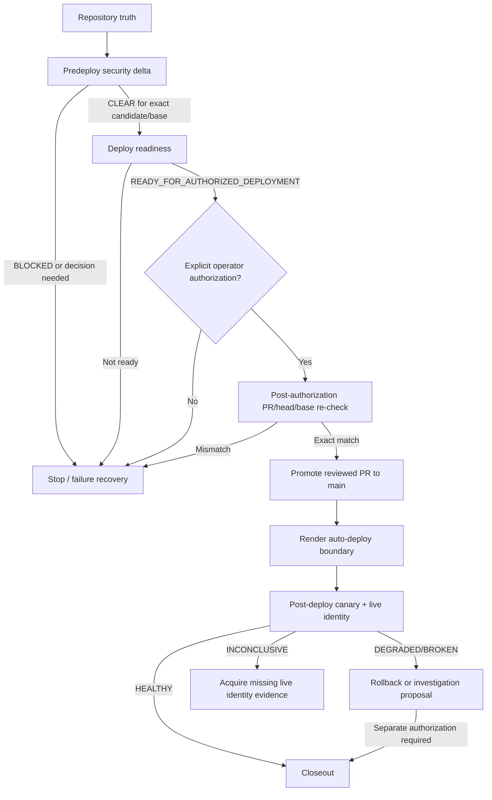

authorityRef: axtask.agent-authority.v1

# Workflow: main branch deployment

id: axtask.main-branch-deployment.v1

## Purpose

Provide one fail-closed AxTask release sequence from candidate intake through production-connected `main` promotion and post-deploy verification.

The workflow harvests only the deployment-relevant gstack ideas: fresh verification on every release attempt, infrastructure detection before irreversible action, explicit authorization at the live boundary, exact candidate binding, and a post-deploy canary. AxTask's existing validators, backup certification, local production certification, and proof schemas remain canonical.

## Trigger

`main-branch-deployment-requested`

## Preconditions

- repository authority and harness are current;
- candidate SHA, currently observed candidate ref/PR-head SHA, candidate base SHA, and current `origin/main` SHA are explicit;
- no unrelated work is included;
- deployment is intended for AxTask's production-connected `main` release contract;
- `render.yaml` auto-deploy semantics are read from the current candidate;
- live mutation is not performed until the explicit authorization gate.

## Failure-chain diagram

## Sequence

1. **Repository truth**
   - run `axtask.repository-intake.v1`;
   - refresh `origin/main`, PR floor, target PR number/head SHA, candidate base SHA, exact candidate SHA, and changed paths;
   - read authoritative `render.yaml` values and `.ai/codebase-map.json`.
2. **Security delta**
   - run `axtask.skill.predeploy-security-review.v1` when deployment-sensitive/high-risk or deployment-control harness paths changed;
   - require `.ai/runs/<run-id>/predeploy-security-review.json` with disposition `CLEAR` tied to the exact candidate SHA and base SHA before the authorization boundary;
   - block on unresolved concrete security findings or stale security evidence.
3. **Deploy readiness**
   - run `axtask.skill.deploy-readiness.v1`;
   - bind readiness to the current candidate ref/PR head and current base rather than requiring the pre-merge candidate to equal `main`;
   - while current repository evidence still says production-connected `main` will trigger Render auto-deploy, pass `promotionWillAutoDeploy: true` to `axtask.predeploy-cost-readiness.v1` so docs/harness-only promotions cannot bypass the deploy floor;
   - execute selected validators rather than treating selection as proof;
   - collect backup/local-runtime evidence required by the actual promotion boundary.
4. **Authorization gate**
   - require a current `READY_FOR_AUTHORIZED_DEPLOYMENT` verdict tied to the exact candidate and base;
   - require the current `CLEAR` predeploy security artifact for that same candidate/base;
   - require explicit operator authorization for the live promotion;
   - if any are absent, stop without advancing `main`.
5. **Promotion**
   - run `axtask.skill.authorized-main-deploy.v1`;
   - after authorization, re-fetch PR number/head SHA, current `main` SHA, mergeability, and required checks before merging to close the TOCTOU window;
   - prefer the reviewed PR merge path;
   - record merge/main SHA and promotion timestamp;
   - because `autoDeploy: true`, treat the production-connected main mutation as the live-deployment trigger.
6. **Canary**
   - run `axtask.skill.post-deploy-canary.v1` as soon as live evidence can be collected;
   - record `/health`, explicit `/ready`, public-shell, provider identity/status, and expected SHA evidence;
   - never classify `HEALTHY` when deployment identity is `LIVE_SHA_UNVERIFIED`.
7. **Closeout**
   - classify `HEALTHY`, `DEGRADED`, `BROKEN`, or `INCONCLUSIVE`;
   - render operator report and final handoff;
   - for unhealthy results, provide rollback/investigation action without performing destructive rollback unless separately authorized.

## Diagnosis note

The repository already owned validation, backup recovery proof, migration/bootstrap proof, local production certification, and predeploy readiness. The missing deployment layer was the exact-SHA choreography around those components: predeploy security evidence, a pre-merge candidate/base model, explicit main-promotion authorization, a post-authorization state re-check, auto-deploy promotion exposure, and live canary identity verification.

## Testing note

The owning validation plan is selected by `axtask.main-branch-deployment.v1` and includes harness/run-context contracts, account-backup certification, predeploy readiness, local production certification, release/typecheck/tests/build, and deployment contracts through the registry dependency graph. CI additionally runs Docker build, Playwright regression, bundle/performance checks, fresh Drizzle+migration/idempotence proof, schema verification, and the local production launcher certification. Readiness contracts separately prove pre-merge PR-head/base semantics and that a docs/harness-only main promotion with auto-deploy enabled still requires the production floor.

## Rollout note

Land this harness through a reviewed feature-branch PR only after the exact PR head is green. Do not use `npm run ship` on `main`. When a real release is authorized, execute this workflow from a fresh candidate/base snapshot and treat the production-connected main mutation as the live boundary because `render.yaml` has `autoDeploy: true`.

## Rollback / recovery note

A harness-only regression is rolled back by reverting the harness PR through the normal reviewed-PR path. A live application deployment rollback is a separate production mutation and requires separate operator authorization. Validator/workflow failures route through [`failure-recovery.md`](failure-recovery.md); PR convergence/repair uses [`pr-closeout.md`](pr-closeout.md). Do not auto-rollback production from the canary skill.

## Non-negotiable gates

- Do not use `npm run ship` as deployment certification or on `main`.
- Do not promote a SHA that differs from the certified current candidate ref/PR head.
- Do not promote when current `main` differs from the recorded candidate base.
- Do not promote without a current `CLEAR` security-review artifact for the exact candidate/base.
- Do not reuse stale CI/security/local-runtime evidence after candidate or base changes.
- Do not emit `NO_DEPLOY_NEEDED` for an intended production-connected main promotion while repository evidence says that promotion will auto-deploy.
- Do not claim live deployment from repository evidence.
- Do not claim `HEALTHY` from merge/provider/HTTP status without verifying live deployment identity.
- Do not force-update `main`.
- Do not run production `db:push` as an implicit deploy step.
- `/health` is liveness; `/ready` is explicit DB readiness.

## Canonical existing workflows reused

- `axtask.predeploy-cost-readiness.v1`
- `axtask.account-backup-roundtrip-certification.v1`
- `axtask.local-deployment-certification.v1`
- `axtask.failure-recovery.v1`
- `axtask.pr-closeout.v1`

## Outputs

Use the existing artifact registry plus the deployment security artifact:

- repo snapshot;
- validator plan;
- predeploy security review;
- predeploy readiness;
- account backup certification when applicable;
- runtime proof;
- operator report;
- final handoff.

## Proof ceiling

This workflow may reach live read-only health proof only when the live promotion and canary actually execute and the live deployment identity is tied to the expected release. Registration, contract tests, and local production certification alone prove only the repository/local deployment harness.
