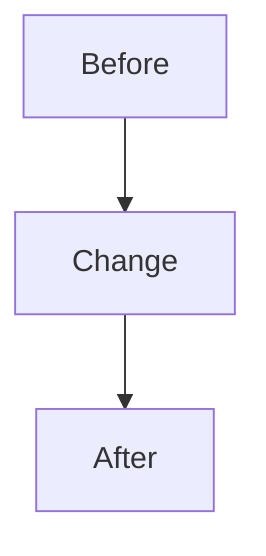

## Summary

<!-- What does this PR change? -->

## Diagnosis / why this exists

<!-- What problem, incident, risk, or objective forced this change? Be concrete. -->

## Changed files by purpose

<!-- Group important files by purpose: runtime, docs, tests, CI, migrations, env/config. -->

## OPSEC quick scan (check before requesting review)

- [ ] **No secrets in diff** — no production URLs with embedded passwords, API keys, `DATABASE_URL`, `SESSION_SECRET`, OAuth client secrets, or Render env dumps.
- [ ] **Templates only in git** — real values stay in **Render / Neon / `.env.render` (local, gitignored)**.
- [ ] **Deploy files** — if you changed `render.yaml`, Docker, startup, auth/session, schema, or env code, say so below; expect stricter review.

## Risk / rollout / rollback

<!-- What can go wrong? How does this roll out? How do we back out? -->

## Mermaid / workflow diagram

<!-- Required when changing deploy, schema evolution, startup paths, incident response, auth, or env automation. -->

## How tested

<!-- e.g. npm test, npm run test:deploy, manual Render redeploy, /health, /ready, auth smoke path -->

## Tag / retrieval note

<!-- If this is an incident fix, architecture checkpoint, or release, recommend an annotated tag after merge. Example: incident/axtask-topic-YYYY-MM-DD -->
