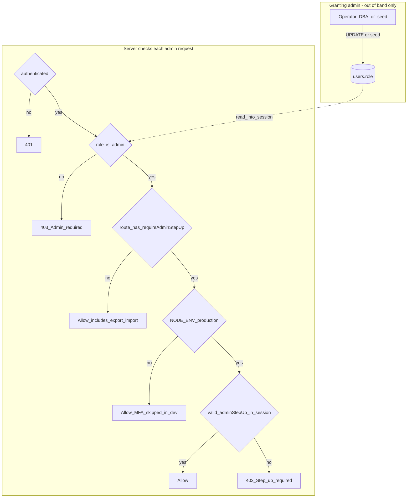

# Admin access model (maintainers)

Internal reference for how **Security Admin** (`role === "admin"`) is assigned, what gates API use, and what is **not** covered by admin role alone. For operator coin policy see [OPERATOR_COIN_GRANTS.md](OPERATOR_COIN_GRANTS.md).

**Assignment stance:** Granting admin is **out of band** (database, deploy, or local seed). There is **no** self-service “promote to admin” in the [route inventory](../server/__snapshots__/routes-inventory.contract.test.ts.snap). As long as only trusted operators can change `users.role`, the product does not expose a separate HTTP path to elevate privileges.

## Threat-model note (what lowers the bar)

Shipping any of the following would materially weaken the model: self-service role elevation; a shared secret or API key that grants admin without DB governance; skipping MFA step-up on **more** routes in production; or powerful actions keyed only on “logged in” without `role === "admin"`.

**Gaps to watch in current code:** **export/import** and **admin password reset** do not use `requireAdminStepUp`, so an **existing admin session** (without a fresh step-up) is still enough for those—align trust and account hygiene accordingly.

## Diagram: assignment vs per-request gates

**How to read it:** **Top — entry:** There is no HTTP path from a normal user to `users.role = admin`; only operator/seed/DB-style assignment. **Bottom — use:** After `role === admin`, each route either requires MFA step-up in production (when `requireAdminStepUp` is on the route) or does not (routes without that middleware, notably bulk **export/import**).

## How someone becomes an admin

- **Primary gate:** The session user must have **`role === "admin"`** on the `users` row. The server enforces this in [`server/routes.ts`](../server/routes.ts) via `requireAdmin` (401 if not logged in, 403 if role is not admin).
- **No automated onboarding in API inventory:** The route snapshot lists all registered `/api/admin/*` handlers. There is **no** route such as “promote user to admin.” Granting admin is an **operator/DB action** (see also [`sql/ops/list-admin-users.sql`](../sql/ops/list-admin-users.sql)). Local dev seeding can create an admin user ([`server/seed-dev.ts`](../server/seed-dev.ts) includes `admin@axtask.local` with `role: "admin"`).
- **Mechanical ease vs operational control:** Updating a row is simple; **who may do it** is your org’s DB and deployment access control.

## Barriers after you have `role: admin`

| Layer | Behavior |
|--------|------------|
| **Client** | [`client/src/pages/admin.tsx`](../client/src/pages/admin.tsx) shows “Access Denied” unless `user?.role === "admin"`. Sidebar adds “Security Admin” only for admins ([`client/src/components/layout/sidebar.tsx`](../client/src/components/layout/sidebar.tsx)). |
| **Production MFA step-up** | For `NODE_ENV === "production"`, most admin endpoints also use `requireAdminStepUp`: session must carry `adminStepUp.expiresAt` within a **1-hour** window set by `POST /api/admin/step-up` after MFA verification ([`server/routes.ts`](../server/routes.ts)). In non-production, step-up is **skipped** (`requireAdminStepUp` returns `next()`). |
| **Export / import (exception)** | `POST/GET /api/admin/export*`, `POST /api/admin/import*`, and `POST /api/admin/import/validate` use **`requireAdmin` only** (plus `migrationLimiter`)—**not** `requireAdminStepUp`. In production, **full-database export/import** does not require the MFA step-up session, only the admin role + auth. |
| **Other admin-only auth** | e.g. `POST /api/auth/admin/reset-password` checks `req.user.role === "admin"` with `requireAuth` but is **outside** the step-up middleware pattern ([`server/routes.ts`](../server/routes.ts) ~982–1004). |

## What “admin” does **not** automatically include

- **Discretionary AxCoin grants** are **not** tied to admin role alone. They require the caller’s user id in **`OWNER_COIN_GRANT_USER_IDS`** ([OPERATOR_COIN_GRANTS.md](OPERATOR_COIN_GRANTS.md)).

## Feature surface (backend routes in inventory)

Representative areas backed by `/api/admin/*` today (full list in the snapshot): user listing and ban/unban; security logs/events/alerts; feedback inbox; analytics overview; storage/usage/DB size and retention tooling; classification category review; performance heuristics; repo/git inventory; data export/import; step-up endpoints.

**UI vs server caveat:** [`client/src/pages/admin.tsx`](../client/src/pages/admin.tsx) calls endpoints such as **`/api/admin/appeals`** and **`/api/admin/users/.../premium/lifetime-*`**, but those paths **do not appear** in the route snapshot. Treat those parts of the admin UI as **not wired to the current server** unless you add matching routes—when describing “what admin entails” to others, prefer the **snapshot list** as the source of truth for implemented APIs.

## Talking points for people you grant admin

- They need an **account whose `role` is set to `admin`** by someone with DB/deploy access—**not** something they can grant themselves in-app.
- In **production**, they should expect **MFA step-up** for most operator console actions (hourly re-verification).
- **Highest-risk capabilities** include **full export/import** (no step-up in code) and **admin password reset**; align expectations and trust accordingly.
- **Coin grants** and similar policies may need **extra env allowlists**, not just the admin role.
