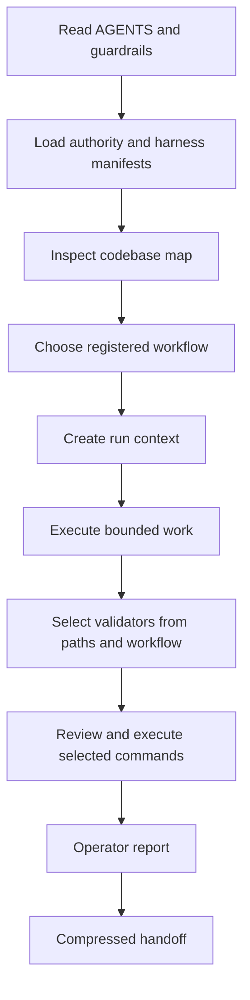

# AxTask repository AI harness

AxTask's repo-local harness is a control plane for repository agents. It is not a prompt collection.

## Components

- `AGENTS.md` and `AGENT_GUARDRAILS.md`: human-readable operating law
- `.ai/authority.json`: canonical precedence and stale-context rejection
- `.ai/harness.json`: component inventory, skill inventory, registry references, hook policy, and read-only intelligence entry point
- `.ai/codebase-map.json`: current roots, entry points, validation surfaces, and high-risk paths
- `.ai/workflow-registry.json`: canonical workflow inventory
- `.ai/workflows/`: repository intake, PR closeout, and local deployment certification procedures
- `.ai/run-context.schema.json`: required per-run boundaries, owner, environment class, and proof ceiling
- `.ai/runtime-proof.schema.json`: required shape for local, staging, live, deployment, and operator evidence
- `.ai/artifact-registry.json`: tracked versus ignored output policy and forbidden tracked outputs
- `.ai/validator-registry.json`: executable validation commands, changed-path selectors, workflow selectors, dependencies, and conservative fallback policy
- `.ai/capability-registry.json`: canonical capability inventory with truthful `available` or `planned` status
- `.ai/trigger-registry.json`: canonical deterministic trigger conditions and routing
- `.ai/ownership-rules.json`: single-owner policy for shared surfaces
- `.ai/skills/`: scoped, discoverable operating skills
- `scripts/ai-harness/inspect-repo.mjs`: read-only evidence snapshot
- `scripts/ai-harness/select-validators.mjs`: read-only validator-plan generator
- `scripts/ai-harness/validate-run-context.mjs`: run-context type, reference, and proof-ceiling validator
- `scripts/ai-harness/validate-runtime-proof.mjs`: runtime-proof type and proof-escalation validator
- `.ai/reports/` and `.ai/handoff/`: English operator report and compressed handoff contracts
- `.githooks/pre-commit`: optional local validator hook

Workflow and trigger routes are owned by their registries, not copied into `.ai/harness.json`. A capability is `available` only when its executable command exists; future operations retain a `plannedCommand` and may not be invoked as implemented behavior.

## Fresh-agent path



## Validator selection

The selector is deterministic and read-only. It can consume:

- repeated `--changed <path>` arguments;
- a newline-delimited `--changed-file`;
- a run context through `--context`, using `likelyFiles`, `collisionFiles`, and `workflowId`;
- current staged, unstaged, and untracked working-tree paths when no explicit input is supplied.

```bash
node scripts/ai-harness/select-validators.mjs \
  --context .ai/runs/<run-id>/context.json \
  --output .ai/runs/<run-id>/validator-plan.json
```

The output lists commands and reasons but never executes them. Validator prerequisites are expanded automatically. Unmapped paths fail conservatively to release check, typecheck, full tests, and production build. Written plans are restricted to ignored `.ai/runs/` paths.

## Validation

```bash
node scripts/ai-harness/validate-authority.mjs
node scripts/ai-harness/validate-harness.mjs
node scripts/ai-harness/validate-run-context.mjs .ai/runs/<run-id>/context.json
node scripts/ai-harness/validate-runtime-proof.mjs .ai/runs/<run-id>/runtime-proof.json
node scripts/ai-harness/select-validators.mjs --changed .ai/validator-registry.json
npx vitest run server/ai-harness/authority-contract.test.ts server/ai-harness/harness-contract.test.ts server/ai-harness/deployment-certification-contract.test.ts server/ai-harness/validator-selection-contract.test.ts
```

## Output policy

Run snapshots, validator plans, generated prompts, and operator scratch reports are ignored under `.ai/runs/` and `.ai/generated/`. Only sanitized, durable evidence such as release notes is tracked.

## Hooks

Hooks are deliberately opt-in. Install locally with:

```bash
node scripts/ai-harness/install-hooks.mjs
```

The installer refuses to overwrite another local hook path unless `--force` is supplied.

## Proof ceiling

Proof levels are ordered and non-equivalent: contract, harness, static test, build, launcher, command acknowledgement, observed behavior, local runtime, staging runtime, live runtime, deployment completion, and operator acceptance.

The harness can prove repository contract structure, validator behavior, and runtime-proof schema enforcement. It cannot prove that an external agent host followed the workflow. Local evidence cannot claim staging or live proof; staging evidence cannot claim live production, deployment completion, or operator acceptance; live claims require a deployment ID, deployment timestamp, and observed endpoints.
