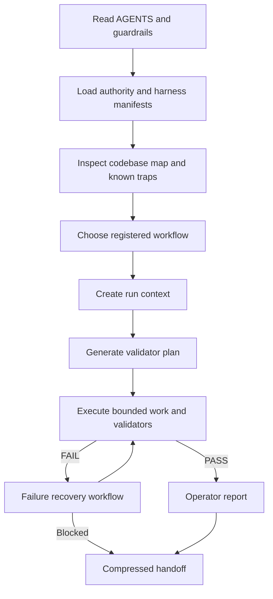

# AxTask repository AI harness

AxTask's repo-local harness is a control plane for repository agents. It is not a prompt collection.

## Components

- `AGENTS.md` and `AGENT_GUARDRAILS.md`: human-readable operating law
- `.ai/authority.json`: canonical precedence and stale-context rejection
- `.ai/harness.json`: component inventory, skill inventory, registry references, hook policy, and read-only intelligence entry point
- `.ai/codebase-map.json`: roots, entry points, configurations, build/test/deploy commands, high-risk paths, and known traps
- `.ai/workflow-registry.json`: canonical workflow inventory
- `.ai/workflows/`: repository intake, PR closeout, failure recovery, and local deployment certification procedures
- `.ai/run-context.schema.json`: required per-run boundaries, owner, environment class, and proof ceiling
- `.ai/runtime-proof.schema.json`: required shape for local, staging, live, deployment, and operator evidence
- `.ai/artifact-registry.json`: artifact producers, generation procedures, naming conventions, tracked versus ignored policy, and forbidden tracked outputs
- `.ai/validator-registry.json`: executable validation commands, changed-path selection, prerequisites, and fallback policy
- `.ai/capability-registry.json`: canonical capability inventory with truthful `available` or `planned` status
- `.ai/trigger-registry.json`: canonical deterministic trigger conditions and routing
- `.ai/ownership-rules.json`: single-owner policy for shared surfaces
- `.ai/skills/`: scoped repository-intake, PR-closeout, failure-recovery, harness-maintenance, and runtime-proof procedures
- `scripts/ai-harness/inspect-repo.mjs`: read-only evidence snapshot
- `scripts/ai-harness/select-validators.mjs`: read-only validator-plan generation
- `scripts/ai-harness/validate-harness.mjs`: base harness and registry cross-reference validator
- `scripts/ai-harness/validate-harness-infrastructure.mjs`: operational map, artifact, failure-recovery, hook, report, and skill completeness validator
- `.ai/reports/`: English operator and failure-report templates
- `.ai/handoff/`: compressed final handoff contract
- `.githooks/pre-commit` and `.githooks/pre-push`: optional local guards

Workflow and trigger routes are owned by their registries, not copied into `.ai/harness.json`. A capability is `available` only when its executable command exists; future operations retain a `plannedCommand` and may not be invoked as implemented behavior.

## Fresh-agent path



## Workflow selection

| Condition | Workflow |
|---|---|
| Fresh agent or uncertain repository state | `axtask.repository-intake.v1` |
| Existing PR requires repair, merge, or closure | `axtask.pr-closeout.v1` |
| Validator, hook, build, CI job, or workflow step fails | `axtask.failure-recovery.v1` |
| Current candidate needs disposable local certification | `axtask.local-deployment-certification.v1` |

## Validation

```bash
node scripts/ai-harness/validate-authority.mjs
node scripts/ai-harness/validate-harness.mjs
node scripts/ai-harness/validate-harness-infrastructure.mjs
node scripts/ai-harness/validate-run-context.mjs .ai/runs/<run-id>/context.json
node scripts/ai-harness/validate-runtime-proof.mjs .ai/runs/<run-id>/runtime-proof.json
npx vitest run server/ai-harness/authority-contract.test.ts server/ai-harness/harness-contract.test.ts server/ai-harness/deployment-certification-contract.test.ts server/ai-harness/validator-selection-contract.test.ts server/ai-harness/harness-infrastructure-contract.test.ts
```

The infrastructure validator proves that required component files exist, registries cross-reference correctly, artifacts describe generation and naming, workflows and skills are registered, known traps are mapped, hooks remain opt-in, and operator templates contain the required headings and sanitization markers.

## Artifact policy

Run snapshots, validator plans, runtime proof, failure reports, generated prompts, and operator scratch reports are ignored under `.ai/runs/` and `.ai/generated/`. Only sanitized durable evidence such as release notes is tracked.

Each registry entry states:

- artifact location
- producer
- generation procedure
- naming convention
- tracked and sanitized status
- template or validator when applicable

## Failure handling

The failure-recovery workflow freezes proof at the last passing gate, captures the smallest sanitized reproduction, classifies the failure, respects ownership, bounds retries, reruns the failed validator before broader checks, and produces a human-readable failure report.

It forbids destructive cleanup, weakening contracts to manufacture a pass, automatic live retries, raw-log capture, and proof escalation.

## Hooks

Hooks are deliberately opt-in. Install locally with:

```bash
node scripts/ai-harness/install-hooks.mjs
```

The installer refuses to overwrite another local hook path unless `--force` is supplied.

- Pre-commit: security guards, authority validator, harness validator.
- Pre-push: security guards, authority validator, base and infrastructure completeness validators, focused harness contracts.

## Proof ceiling

Proof levels are ordered and non-equivalent: contract, harness, static test, build, launcher, command acknowledgement, observed behavior, local runtime, staging runtime, live runtime, deployment completion, and operator acceptance.

Harness completeness and CI cannot prove live behavior. A recovered static test does not establish build, launcher, runtime, deployment, or operator acceptance.
