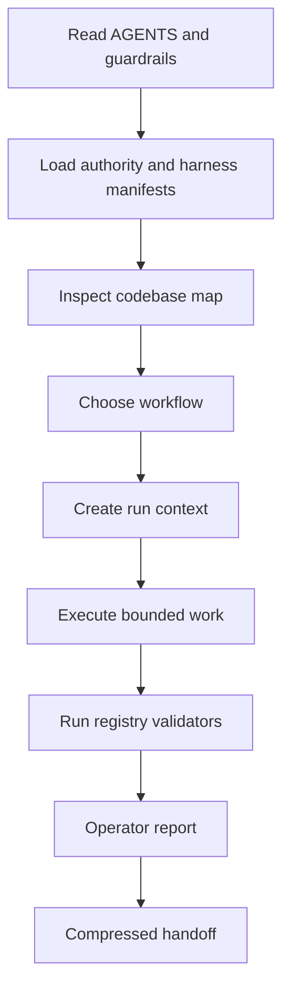

# AxTask repository AI harness

AxTask's repo-local harness is a control plane for repository agents. It is not a prompt collection.

## Components

- `AGENTS.md` and `AGENT_GUARDRAILS.md`: human-readable operating law
- `.ai/authority.json`: canonical precedence and stale-context rejection
- `.ai/harness.json`: component, workflow, skill, trigger, hook, and intelligence registry
- `.ai/codebase-map.json`: current roots, entry points, validation surfaces, and high-risk paths
- `.ai/workflows/`: repository intake and PR closeout procedures
- `.ai/run-context.schema.json`: required per-run boundaries and proof ceiling
- `.ai/artifact-registry.json`: tracked versus ignored output policy
- `.ai/validator-registry.json`: executable validation commands
- `.ai/skills/`: scoped, discoverable operating skills
- `scripts/ai-harness/inspect-repo.mjs`: read-only evidence snapshot
- `.ai/reports/` and `.ai/handoff/`: English operator report and compressed handoff contracts
- `.githooks/pre-commit`: optional local validator hook

## Fresh-agent path



## Validation

```bash
node scripts/ai-harness/validate-authority.mjs
node scripts/ai-harness/validate-harness.mjs
npx vitest run server/ai-harness/authority-contract.test.ts server/ai-harness/harness-contract.test.ts
```

## Output policy

Run snapshots, generated prompts, and operator scratch reports are ignored under `.ai/runs/` and `.ai/generated/`. Only sanitized, durable evidence such as release notes is tracked.

## Hooks

Hooks are deliberately opt-in. Install locally with:

```bash
node scripts/ai-harness/install-hooks.mjs
```

The installer refuses to overwrite another local hook path unless `--force` is supplied.

## Proof ceiling

The harness can prove repository contract structure and validator behavior. It cannot prove that an external agent host followed the workflow, nor can it prove live Render or Neon state.
