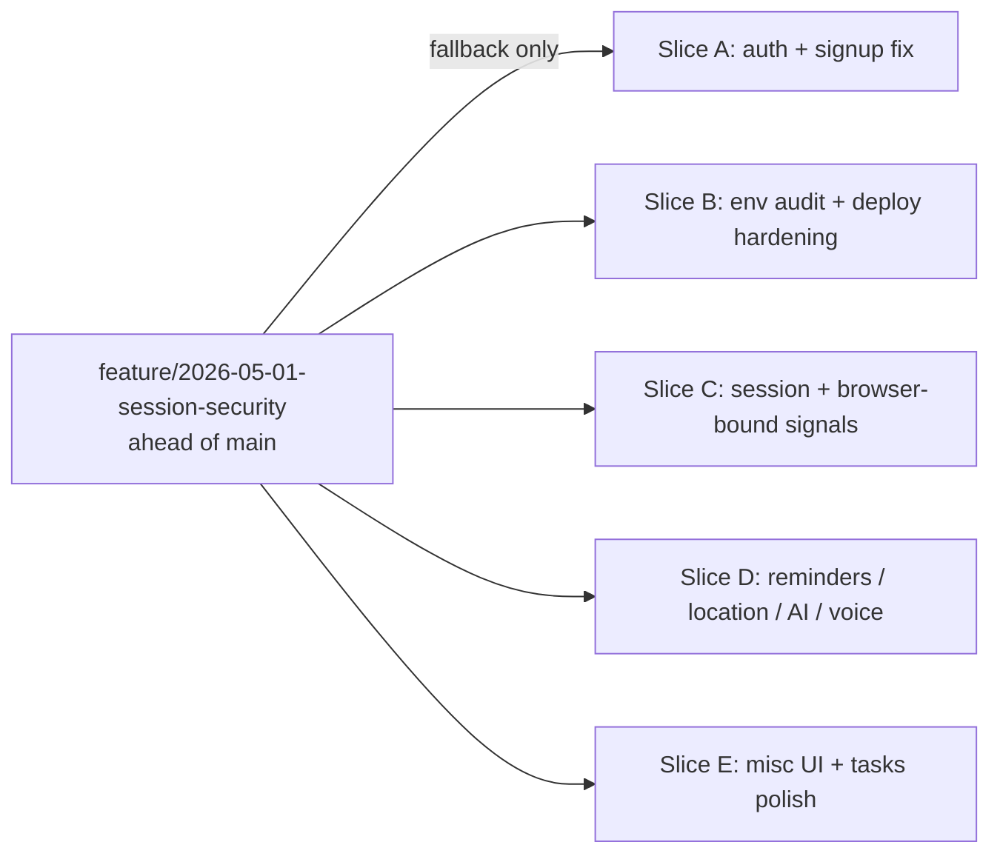

# Branch retirement plan — `feature/2026-05-01-session-security` (2026-05-01)

## 2026-05-01 Main Convergence Candidate

`feature/2026-05-01-session-security` began as session security work but became the convergence runway for session hardening, env audit, browser signals, command parsing, AI task/reminder execution, reminder dispatch, and unstable branch retirement.

No new feature work should be added before merge to `main`.

Single reference for what lives on the consolidation branch and how to split or retire it without losing release-blocking work.



## 1. Stabilization plan (default path)

1. Merge `origin/main` into the consolidation branch.
2. Run `npm run check`, `npm run env:audit:strict`, `npm run test:deploy:env`, and targeted Vitest suites (`server/registration-config.test.ts`, `server/boot-config-summary.test.ts`, `tests/deploy/01-env/**`).
3. Open **one PR** against `main`. Use the slice inventory below as the PR description outline.

## 2. Slice inventory (commit groups)

Commit hashes below are **examples from planning** — always refresh with:

```bash
git log --oneline origin/main..HEAD
```

### Slice A — Auth / signup (PR-A)

**Themes:** registration env + audit + SecureInput, invite UX, signup email readability, OTP branding.

**Representative commits (verify):** `4dddc5f`, `82bb3cd`, `f074954`, `127c2ef`

**Primary files:** `server/registration-config.ts`, `server/registration-config.test.ts`, `server/routes.ts` (auth section), `client/src/components/ui/secure-input.tsx`, `client/src/pages/login.tsx`, `client/src/lib/auth-context.tsx`, `server/services/email-templates.ts`

### Slice B — Env audit + deploy gate (PR-B)

**Themes:** cross-surface env audit, deploy script hardening, template parity.

**Carve from / overlaps with:** same general area as `4dddc5f` (files, not necessarily a clean commit boundary).

**Primary files:** `scripts/audit-env.mjs`, `scripts/deploy/check-env.mjs`, `scripts/production-start.mjs`, `tests/deploy/01-env/*`, `.env.production.example`, `.env.render.example`, `render.yaml`, `docs/ENVIRONMENT_VARIABLES.md`, `.cursor/rules/render-env-automation.mdc`

### Slice C — Session + browser signals (PR-C)

**Representative commits (verify):** `ddfb746`, `218ee52` (re-check exact hash in your log)

**Primary files:** `server/session-config.ts`, `client/src/lib/client-instance-id.ts`, `server/client-instance-observation.ts`, `scripts/analyze-browser-signals.mjs`, `docs/BROWSER_BOUND_SIGNALS.md`, `docs/SESSION_THREAT_MODEL.md`

### Slice D — Reminders / location / AI / voice (PR-D)

**Representative commits (verify):** `636bb57`, `5ec2399`, `c049948`, `6d43e11`, `9dc6e27`, `4cd4049`, `fdab99e`, `4f3070c`, `a958dbc`, `bc205ed`, `a2e278c`

**Primary files:** `server/routes/reminders.ts`, `server/routes/locations.ts`, `server/services/reminder-dispatch.ts`, `server/ai/**`, voice rewards, parser, command palette (as present on the branch)

### Slice E — Misc UI + tasks polish (PR-E)

**Representative commits (verify):** `a1c7193`, `de3d00c`, `e2cd1b2`

**Primary files:** glass search overlay, image paste upload feedback, `.gitignore` + line-ending normalization (as on the branch)

## 3. Recommended PR boundaries

- Open **A → B → C → D → E** only if a single consolidation PR is too large for review or CI starts failing on unrelated lanes.
- If the branch is already green and reviewable, **ship one consolidation PR** and use this document only for context and fallback.

## 4. Branches superseded by this consolidation (candidates to delete after merge)

**Re-check** with `git log --oneline <branch>..HEAD` (or merge-base) before deleting; a branch is safe to remove when it is **fully contained** in the consolidation tip.

**Candidates to delete after successful merge:**

- `feature/2026-04-25-command-engine-release-guardrails`
- `feature/2026-04-25-command-parser-tests`
- `feature/2026-04-25-command-ui-dispatcher`
- `feature/2026-04-25-durable-reminders`
- `feature/ai-location-reminders-foundation`

**Keep (until independently merged or explicitly retired):** e.g. `feature/2026-04-25-pretext-redesign-flash-stability`, `feature/v2-enhancements`, `feature/docker-up-docs-tests` — confirm current remote state before action.

## 5. Rollback / split strategy if the `main` merge fails

1. **Try `git merge origin/main` on the consolidation branch.** If conflicts are large (order of ~30+ files) or hit core monolith hotspots (`server/routes.ts`, `client/src/components/task-list.tsx`, `shared/schema.ts`), **abort** with `git merge --abort` and fall back to slices.
2. **Cut Slice A and Slice B** onto fresh branches from `origin/main` via `git cherry-pick` of the commit groups (refresh hashes from your log). Open as **separate PRs** — they are the smallest, most release-blocking surfaces.
3. **Rebase or cherry-pick** remaining slices onto post-merge `main` once A and B land.
4. If even Slice A conflicts, **rebuild manually** the smallest auth surface: `server/registration-config.ts`, the `routes.ts` register + `/api/auth/config` chunks, and `secure-input.tsx` — that set is the core signup/auth outage fix.
5. **Do not force-push** the open consolidation branch while a PR is in flight; **cut a new branch** instead if you need a clean retry.

## 6. Related operators

- Session / cookie model: [SESSION_THREAT_MODEL.md](./SESSION_THREAT_MODEL.md)
- Env audit and templates: [ENVIRONMENT_VARIABLES.md](./ENVIRONMENT_VARIABLES.md)
- Git / deploy branching: [GIT_BRANCHING_AND_DEPLOYMENT.md](./GIT_BRANCHING_AND_DEPLOYMENT.md)

## Superseded Branches

These remote branches are candidates for deletion **after** `main` includes this convergence work and has been stable for a verification window — always confirm containment with `git log` before deleting.

- `feature/ai-location-reminders-foundation`
- `feature/2026-04-25-command-engine-release-guardrails`
- `feature/2026-04-25-command-parser-tests`
- `feature/2026-04-25-command-ui-dispatcher`
- `feature/2026-04-25-durable-reminders`

## Merged Concepts

What this convergence branch is intended to carry into `main` (high level):

- shared intent parser
- command dispatcher updates
- AI create-task execution
- AI create-reminder execution
- AI interaction feedback
- location/reminder routes
- reminder dispatch service
- task reminders
- session TTL hardening
- registration config audit
- safe boot config summary
- browser-bound signal documentation
- env/deploy audit

## Not Yet Claimed Complete

Honest scope boundaries — do **not** treat as shipped product completeness:

- full recurring task UX
- full mobile-native reminders
- full report planning retrieval
- full branch deletion (supersedes list above)
- production push delivery verification
- full Foundry productization
