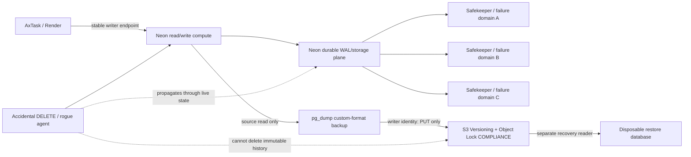

# AxTask Database Resilience

**Status:** active repository contract  
**Provider:** Neon PostgreSQL  
**Scope:** high availability, point-in-time recovery, isolated raw database backups, and destructive-recovery drills

## Principle

Replication and backup solve different failures:

- **High availability (HA)** keeps the application reachable through infrastructure failure.
- **Disaster recovery (DR)** preserves an earlier state after destructive writes, operator mistakes, compromised credentials, or application defects.

A replica that follows the live database is deliberately **not** counted as a backup. A valid `DELETE`, `DROP`, or corrupting application write can propagate through the live data plane. AxTask therefore requires both a managed HA path and a security boundary containing immutable cold backups.

## Neon adaptation

AxTask production uses Neon, so the generic "one primary plus two promotable PostgreSQL standby machines" topology is not the repository's literal production model. Neon separates compute from storage. Its storage layer durably records WAL across multiple Safekeepers/failure domains, while a failed compute can be replaced behind the same endpoint. Neon read replicas are independent read-only compute endpoints over the **same underlying storage**, so they improve read scale but are not independent DR copies.

The machine-readable policy is [`config/database-resilience.json`](../config/database-resilience.json). `scripts/db/validate-resilience-config.mjs` fails if a future change starts counting Neon read replicas as independent failover/data copies.



## Service objectives and proof

| Track | Repository target | Mechanism | Proof |
|---|---:|---|---|
| HA compute recovery | RTO <= 30 seconds | Neon-managed compute replacement + stable writer endpoint + PostgreSQL client reconnect | non-production provider failover drill / provider evidence |
| HA storage durability | >= 3 failure domains | Neon managed storage/WAL replication | provider contract/evidence; not an AxTask-created standby cluster |
| PITR | >= 24 hours | Neon project history retention | `node scripts/db/neon-resilience-audit.mjs` |
| Cold-backup RPO | <= 6 hours | external systemd timer + `pg_dump -Fc` | timer state + successful immutable manifest |
| Cold-backup retention | >= 30 days | S3 Versioning + Object Lock `COMPLIANCE` | backup preflight refuses a weaker bucket |
| Restore confidence | <= 30 days between drills | exact-manifest restore to disposable PostgreSQL | `restore-cold-backup-s3.mjs` PASS evidence |
| Destructive-error proof | monthly / before major DB recovery changes | loopback-only rogue-delete drill | `rogue-delete-drill.mjs` PASS evidence |

These are **targets**, not claims that production currently satisfies every line. Repository/CI proof cannot substitute for provider/runtime proof.

## Track 1 — High availability

### Stable production endpoint

Application code continues to use one provider-issued `DATABASE_URL`. It must not hard-code individual compute hosts or implement application-side leader election. PostgreSQL clients are expected to reconnect after transient provider failover/restart events.

### Provider readiness audit

Use a read-only Neon API token in the protected operator context:

```bash
NEON_API_KEY='<secret>' \
NEON_PROJECT_ID='<project-id>' \
node scripts/db/neon-resilience-audit.mjs
```

The audit checks the configured minimum PITR window, existence/state of the default branch, and a read/write endpoint. It prints no API key or database URL. A nonzero exit means the provider side has not yet earned the repository's resilience target.

### Non-production compute restart drill

Do **not** kill production PostgreSQL or mutate the production Neon branch to satisfy a test. `scripts/db/neon-compute-restart-drill.mjs` exercises Neon's supported compute-restart API against a dedicated non-production branch and measures database reconnection. It refuses the default/primary branch, refuses branch names `main`, `master`, `prod`, and `production`, requires the database host to match the declared endpoint, and issues the non-idempotent restart request only once.

```bash
NEON_API_KEY='<secret>' \
NEON_PROJECT_ID='<project-id>' \
NEON_DRILL_BRANCH_ID='<non-production-branch-id>' \
NEON_DRILL_ENDPOINT_ID='<non-production-endpoint-id>' \
DRILL_DATABASE_URL='<connection string for that exact endpoint>' \
DRILL_READY_URL='https://<non-production-app>/ready' \
node scripts/db/neon-compute-restart-drill.mjs --confirm=NONPROD_COMPUTE_RESTART
```

With `DRILL_READY_URL`, a PASS proves both database reconnection and application readiness recover within the configured 30-second RTO. Without it, the command proves only database reconnection and reports that application probing was not configured. Run mock application traffic separately if you need a stronger user-visible continuity measurement.

## Track 2 — Isolated cold backups

AxTask already has a recovery airlock and local protected raw-database backup/restore path in `docs/DB_RECOVERY_RUNBOOK.md`. This track adds a second, off-host security boundary for durable historical copies. It does not replace the existing R3 exact-manifest recovery gate.

### S3 vault requirements

The bucket must have all of these before the first backup:

- S3 Versioning enabled;
- S3 Object Lock enabled;
- default Object Lock mode **COMPLIANCE**;
- default retention at least **30 days**;
- encryption at rest;
- live backup identity can upload but cannot read, delete, bypass retention, change versioning/Object Lock, or change lifecycle policy;
- recovery identity is separate, read-only, and cannot upload or delete.

Reference IAM contracts:

- [`infra/aws/cold-backup-live-writer-policy.json`](../infra/aws/cold-backup-live-writer-policy.json)
- [`infra/aws/cold-backup-recovery-reader-policy.json`](../infra/aws/cold-backup-recovery-reader-policy.json)

Replace `REPLACE_WITH_BUCKET_NAME` before attaching the policies. Keep credentials outside the repository.

### Backup runner prerequisites

The cold-backup runner requires `pg_dump`, `psql`, the AWS CLI, a dedicated live-writer AWS identity, an existing absolute staging directory outside the repository checkout, and `DATABASE_URL` loaded through the operator's secret path.

The script validates S3 Versioning and Object Lock configuration **before** reading the database, verifies enough free staging capacity for the source size plus 15% (minimum +1 GiB), creates a custom-format `pg_dump`, hashes it, uploads the dump and exact manifest, and removes the local staging copy after successful upload by default.

```bash
DATABASE_URL='<secret>' \
COLD_BACKUP_STAGING_DIR='/var/lib/axtask-cold-backup' \
COLD_BACKUP_S3_BUCKET='<immutable-bucket>' \
node scripts/db/cold-backup-s3.mjs
```

Optional configuration:

```text
COLD_BACKUP_S3_PREFIX=axtask-db
COLD_BACKUP_AWS_REGION=us-east-1
COLD_BACKUP_AWS_PROFILE=axtask-cold-backup-writer
COLD_BACKUP_S3_KMS_KEY_ID=<kms-key-id>
COLD_BACKUP_KEEP_LOCAL=false
```

A success record contains the exact manifest URI, exact dump URI, SHA-256, byte size, and no database credentials.

### Six-hour scheduling

The live application process does not own this scheduler. Install the dedicated systemd unit on a backup runner so application compromise or restart does not stop the schedule:

```bash
sudo install -o root -g root -m 0644 ops/systemd/axtask-db-cold-backup.service /etc/systemd/system/
sudo install -o root -g root -m 0644 ops/systemd/axtask-db-cold-backup.timer /etc/systemd/system/
sudo systemctl daemon-reload
sudo systemctl enable --now axtask-db-cold-backup.timer
systemctl list-timers axtask-db-cold-backup.timer
```

The service expects the repo at `/opt/axtask`, a non-login `axtask-backup` account, staging at `/var/lib/axtask-cold-backup`, and secrets/config in root-managed `/etc/axtask/db-cold-backup.env`. The timer runs at 00:15, 06:15, 12:15, and 18:15 with up to 15 minutes of randomized delay and `Persistent=true` catch-up after downtime.

The operator must prove the timer, writer identity, storage capacity, and first successful manifest before declaring automated cold backups live.

## Track 3 — Exact restore

Recovery uses a **different AWS identity** and an exact manifest URI. The restore command refuses non-loopback targets and refuses a restore target that equals `DATABASE_URL` when both are supplied.

```bash
RESTORE_DATABASE_URL='postgres://...@127.0.0.1:5432/axtask_restore' \
COLD_BACKUP_RECOVERY_AWS_PROFILE='axtask-cold-backup-reader' \
node scripts/db/restore-cold-backup-s3.mjs \
  --manifest-s3-uri='s3://<bucket>/axtask-db/YYYY-MM-DD/<exact>.manifest.json'
```

The restore path downloads the exact manifest, follows only its recorded dump URI, verifies byte size and SHA-256, runs `pg_restore --clean --if-exists`, then probes the disposable database. It never chooses "latest" implicitly.

## Track 4 — Rogue-delete disaster drill

The drill exists to prove the distinction between replication and backup without endangering real data. It is hard-restricted to loopback PostgreSQL targets and requires an explicit confirmation token.

```bash
DRILL_DATABASE_URL='postgres://...@127.0.0.1:5432/axtask_drill_source' \
DRILL_RESTORE_DATABASE_URL='postgres://...@127.0.0.1:5432/axtask_drill_restore' \
DRILL_REPLICA_URLS_JSON='["postgres://...@127.0.0.1:5433/axtask_drill_replica1"]' \
node scripts/db/rogue-delete-drill.mjs --confirm=ROGUE_DELETE_DRILL
```

It creates only the `axtask_dr_drill` fixture schema, backs that schema up, executes a destructive `DELETE`, optionally verifies that configured test replicas also observe the deletion, restores the pre-delete dump into the separate disposable target, verifies the recovered row count, and removes the fixture schema afterward.

If no replica URLs are supplied, `replicaProof` is `NOT_CONFIGURED`. That run proves the backup/restore half but **does not** prove propagation across a replica topology. A full destructive-recovery runtime proof requires `replicaProof=PASS` and restored-row proof together.

## Repository validation

No external credentials or database are required for the static contract suite:

```bash
node scripts/db/validate-resilience-config.mjs
node --test scripts/db/database-resilience.test.mjs
node --check scripts/db/cold-backup-s3.mjs
node --check scripts/db/restore-cold-backup-s3.mjs
node --check scripts/db/rogue-delete-drill.mjs
node --check scripts/db/neon-resilience-audit.mjs
node --check scripts/db/neon-compute-restart-drill.mjs
systemd-analyze verify ops/systemd/axtask-db-cold-backup.service ops/systemd/axtask-db-cold-backup.timer
```

The Node checks also run in `.github/workflows/database-resilience.yml` when this subsystem changes.

## Rollout

1. Merge repository contracts only after CI is green.
2. In the protected operator context, run the Neon resilience audit. Raise project PITR history only through an explicitly reviewed provider change if it is below the configured target.
3. Provision/configure an Object-Locked S3 bucket and attach the writer/reader policies to separate identities.
4. Install the backup runner and timer, then capture one successful immutable manifest.
5. Restore that exact manifest to disposable PostgreSQL and record PASS evidence outside Git if it contains operational identifiers.
6. Run the loopback rogue-delete drill. Add disposable replica endpoints when testing replica propagation.
7. Run the non-production compute restart drill with the non-production app `/ready` endpoint.
8. Only then mark the operational sprint complete.

## Rollback

- Repository scripts/timer can be disabled or reverted without deleting any backup object.
- Disable the timer with `sudo systemctl disable --now axtask-db-cold-backup.timer` if a backup runner misbehaves.
- Do **not** weaken Object Lock, grant delete permission to the live writer, or shorten retention as a rollback technique.
- Provider PITR changes are separate operator changes and must follow the provider's rollback/cost procedure.
- Existing `docs/DB_RECOVERY_RUNBOOK.md` R3/R4 gates remain authoritative for the current production recovery incident.

## Proof ceiling

This repository can prove policy, fail-closed scripts, static validation, and CI. It cannot prove a provider failover, six-hour scheduled execution, immutable cloud object retention, production PITR history, or a successful real restore until those operator/runtime actions have produced evidence. No destructive production drill is authorized by this document.
