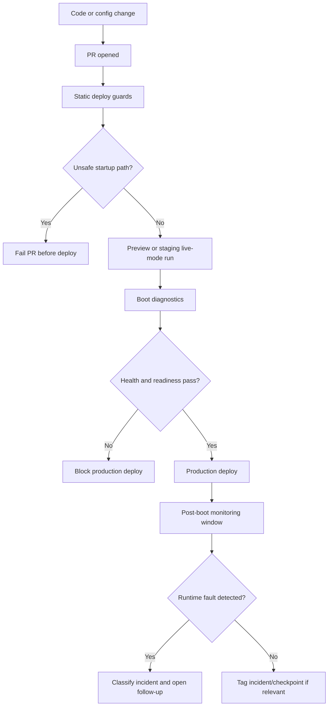
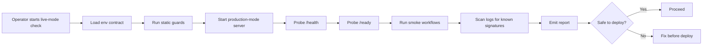
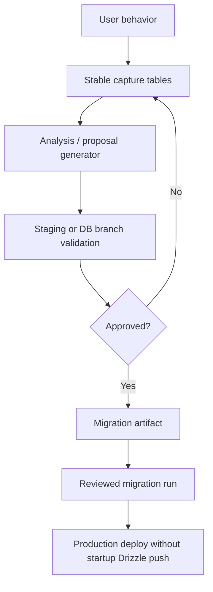
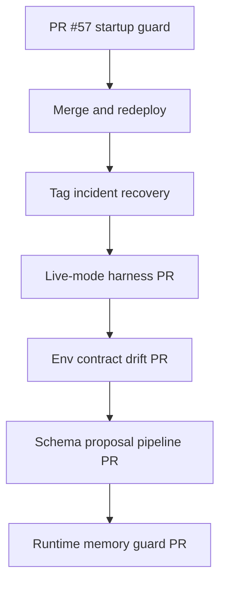

# Deployment Safety & Environment Automation Plan

## Purpose

This plan turns the AxTask Render outage into a repeatable operating model for live-mode testing, deployment diagnostics, environment-variable automation, and controlled schema evolution.

The immediate incident had two visible classes of failure:

1. `drizzle-kit push` ran during production startup and hit an interactive prompt in a non-interactive Render/Docker environment.
2. The app later booted and served on port 5000, then crashed with a Node heap out-of-memory fatal error.

The fix is not one magic flag. The fix is a deployment safety layer that classifies failures before deploy, during deploy, and after boot.

## Current diagnosis from latest logs

```text
Pulling schema from database...
Interactive prompts require a TTY terminal
...
[express] serving on port 5000
...
FATAL ERROR: Ineffective mark-compacts near heap limit Allocation failed - JavaScript heap out of memory
```

Interpretation:

- Drizzle is still being invoked in the currently deployed runtime, which means production has not yet fully adopted the startup guard from PR #57 or is using an older/stale Docker/start command path.
- The server did eventually bind to port 5000, so the app can boot.
- A second operational problem is present: memory pressure after startup. Treat that as a separate incident class, not a continuation of the Drizzle failure.

## Target operating model



## Failure-class matrix

| Class | Detection signal | Likely cause | Required response |
|---|---|---|---|
| Startup Drizzle prompt | `Interactive prompts require a TTY terminal` | `drizzle-kit push` in non-interactive runtime | Block startup-time Drizzle; run schema sync manually or through approved migration flow |
| Split startup path | Docker/Render/npm commands disagree | Runtime drift | Force all runtime paths through `scripts/production-start.mjs` |
| Env contract failure | `check-env failed` or missing env output | Render/dashboard drift | Update env contract, not random dashboard poking |
| DB capacity failure | DB capacity gate exits non-zero | Neon/storage ceiling risk | Reclaim/upgrade/acknowledge deliberately |
| Readiness failure | `/health` passes but `/ready` fails | DB unreachable or migration issue | Do not route production traffic |
| Runtime OOM | `JavaScript heap out of memory` | memory leak, large startup job, unbounded query, background worker, build/runtime limit | profile memory, isolate worker, cap batch sizes, increase plan only after evidence |

## Live-mode harness goals

The live-mode harness should make production-like testing cheap, repeatable, and clear.

Minimum useful version:

1. Run env contract checks.
2. Run production startup guard checks.
3. Run migration dry-run or migration status checks.
4. Start the app in production mode locally or in a preview environment.
5. Hit `/health` and `/ready`.
6. Run an auth smoke path if credentials are configured.
7. Run a representative task CRUD smoke path.
8. Watch logs for known failure signatures.
9. Emit a short Markdown report.

## Live-mode flow



## Environment automation model

Environment variables need a contract, not folklore.

Recommended layers:

1. `.env.example` and production examples define names only.
2. `render.yaml` codifies non-secret defaults and required secret keys.
3. `scripts/deploy/check-env.mjs` validates required runtime values.
4. CI verifies templates, Render config, and source references remain aligned.
5. A future operator command emits a redacted env report: configured/missing/unused, never secret values.

## Schema evolution compromise

AxTask may learn from user behavior. It should not mutate production schema during app boot.



## OOM follow-up plan

The latest logs show a separate runtime memory failure after the app started.

Next investigation steps:

1. Identify whether the crash happens at idle or after a request/background worker.
2. Temporarily disable optional background workers one at a time:
   - retention prune
   - DB size snapshot
   - archetype rollup
   - reminder dispatch
   - backup workers
3. Add process memory telemetry at boot and at worker ticks.
4. Cap batch sizes for background jobs.
5. Avoid full-table reads in startup or interval workers.
6. Only increase Render plan/memory after identifying whether the problem is expected load or a leak.

## PR sequencing



## Suggested tags after merge

```text
incident/axtask-drizzle-startup-guard-2026-05-21
checkpoint/deployment-safety-env-automation-2026-05-21
```

## Acceptance criteria for the next implementation PR

- `npm run live:check` or equivalent exists.
- The check emits a Markdown report.
- Known failure signatures are classified.
- `/health` and `/ready` are checked.
- Startup-time Drizzle usage remains blocked by CI.
- The OOM class is included in log classification.
- Docs include Mermaid diagrams and operator workflow.
