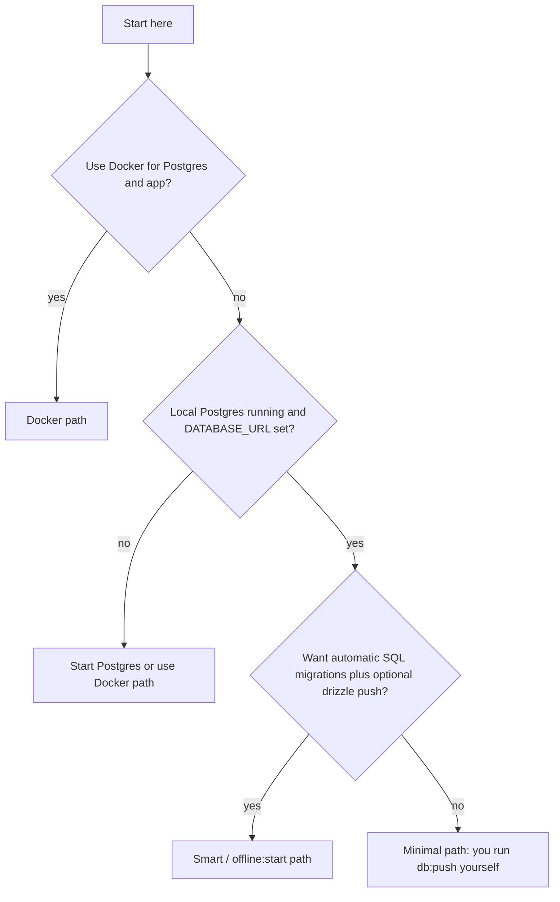
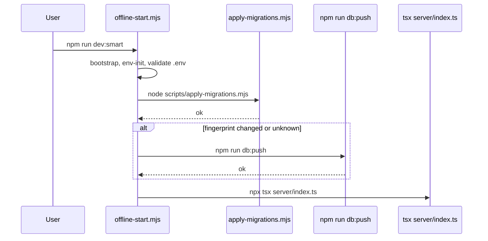

# Development, database, and schema sync

This document is the **single reference** for which commands to run, in what order, and how they differ from Docker and production. Run all CLI commands from the **repository root** (`AxTask`).

For environment variable reference, see [`.env.example`](../.env.example). For Docker Desktop onboarding, see [DOCKER_FOUNDATION.md](./DOCKER_FOUNDATION.md).

## Prerequisites

| Requirement | Local Node (`npm run dev` / smart start) | Docker (`npm run docker:start`) |
|-------------|------------------------------------------|----------------------------------|
| Node + npm | Yes | Image includes Node |
| PostgreSQL reachable at `DATABASE_URL` | Yes | Compose starts Postgres |
| Docker Desktop or Engine + Compose | No | Yes |

## Environment files

| File | Used by | Purpose |
|------|---------|---------|
| `.env` | `tsx server/index.ts`, `npm run db:push`, smart start | Local development; **never commit** real secrets. |
| `.env.docker` | `docker compose --env-file .env.docker` | Compose stack (`npm run docker:*`). Copy from `.env.docker.example`. |

## Choose a path (decision)



## Path A: Minimal local development

Use this when you already manage the database yourself and want the fastest edit–reload loop.

1. `npm install`
2. Copy env: `cp .env.example .env` (Windows: `Copy-Item .env.example .env`)
3. Edit `.env`: set `DATABASE_URL` and `SESSION_SECRET` (see `.env.example`).
4. After **any** change to Drizzle schema (`shared/schema.ts`), `drizzle.config.ts`, or when the DB is new:  
   `npm run db:push`
5. If the repo added or changed files under `migrations/*.sql`, apply them **before** or alongside push:  
   `node scripts/apply-migrations.mjs`  
   then `npm run db:push` if needed for Drizzle drift.
6. `npm run dev` — starts **only** the dev server (`tsx server/index.ts`). **No** migrations and **no** `db:push` run automatically.

Open `http://localhost:5000`.

## Path B: Smart local start (`dev:smart` / `offline:start`)

Same as: `npm run dev:smart`, `npm run offline:start`, Windows `start-offline.cmd` (when it invokes this flow).

Implemented in [`tools/local/offline-start.mjs`](../tools/local/offline-start.mjs). **Order matters:**

1. `tools/local/repo-bootstrap.mjs` (first-time repo setup hooks).
2. `npm run local:env-init` (ensures `.env` exists from template where applicable).
3. Install `node_modules` on first run if missing (`npm run deps:sync`).
4. Load `.env` and validate `DATABASE_URL` is set.
5. **`node scripts/apply-migrations.mjs`** — runs every time; applies pending `migrations/*.sql` in lexicographic order (tracked in `applied_sql_migrations`).
6. If lockfile or `package.json` fingerprint changed: `npm run deps:sync`.
7. **Fingerprint** over `shared/schema.ts`, `drizzle.config.ts`, and **all `migrations/*.sql` contents**.  
   - If unchanged vs `.local/smart-start-state.json`: skip `db:push`.  
   - If changed (or fingerprint unavailable): `npm run db:push`.
8. `npx tsx server/index.ts` (same entry as plain dev; **not** `npm run dev`).



## Path C: Docker Compose (`npm run docker:start`)

Requires `.env.docker` (copy from `.env.docker.example`; set `POSTGRES_PASSWORD`, `SESSION_SECRET`, and matching `DATABASE_URL`).

Compose order ([`docker-compose.yml`](../docker-compose.yml)):

1. **database** — Postgres; healthcheck `pg_isready`.
2. **migrate** — one-shot container:  
   `node scripts/apply-migrations.mjs && npm run db:push`  
   **SQL migrations always run before** Drizzle push.
3. **app** — starts only after `migrate` **completed successfully**; exposes port **5000**.

Health checks:

- **`GET /health`** — process is up (does not require DB).
- **`GET /ready`** — `SELECT 1` on the pool; **503** if the database is unreachable (used by compose app healthcheck).

## Path D: Production container CMD

The runtime image [`Dockerfile`](../Dockerfile) ends with:

```text
node scripts/apply-migrations.mjs && npx drizzle-kit push --force && node dist/index.js
```

So: **versioned SQL migrations → forced Drizzle schema sync → Node server**. CI and [`server/deploy-schema-workflow.test.ts`](../server/deploy-schema-workflow.test.ts) guard this ordering.

## Optional scripts and flags

| Item | Purpose |
|------|---------|
| [`tools/local/dev-with-db-push.mjs`](../tools/local/dev-with-db-push.mjs) | Alternative entry: `apply-migrations.mjs` → `pre-db-push-kit-workarounds.mjs` → `npm run db:push` → `tsx server/index.ts`. Not wired as a default `npm` script; run via `node tools/local/dev-with-db-push.mjs` if you use it. |
| `SKIP_DB_PUSH_ON_START=true` | Only affects `dev-with-db-push.mjs`: skips Drizzle push (still runs SQL migrations before skip). |
| `DISABLE_DEV_SEED`, `DEV_SESSION_MEMORY_STORE` | See [`.env.example`](../.env.example) and server auth/seed docs. |

## Guardrails in the repo

- **`npm test`** includes [`server/deploy-schema-workflow.test.ts`](../server/deploy-schema-workflow.test.ts), which asserts Docker / compose / offline-start / dev-with-db-push **ordering** and key `package.json` scripts.
- **`npm run check:startup-seeds`** — Vitest guard for non-fatal seed patterns in `server/routes.ts` (see test file in repo).

## Troubleshooting

### Port already in use (`EADDRINUSE` on 5000) or `npm ci` EPERM on Rollup (Windows)

Something is still bound to the dev port (often a leftover `node` / Vite / `tsx` process), which can also lock native modules under `node_modules`.

1. Stop dev servers and test watchers, or run:

   ```bash
   npm run port:free:dry
   npm run port:free
   ```

   Default port is **`PORT`** from the environment or **5000**. Another port:

   ```bash
   npm run port:free -- 3000
   ```

   Implementation: [`tools/local/kill-port-listeners.mjs`](../tools/local/kill-port-listeners.mjs) (Windows: `netstat -ano` + `taskkill /F`; Unix: `lsof` + `kill -9`).

2. Retry `npm ci` or `npm install` from the repo root.

## Quick command summary

| Goal | Command |
|------|---------|
| Free default listen port (5000) for dev | `npm run port:free:dry` then `npm run port:free` |
| Create `.env` from `.env.example` (first-time) | `npm run local:env-init` |
| Fastest dev (you handle DB + schema) | `npm run dev` |
| Local dev with automatic SQL migrations + conditional `db:push` | `npm run dev:smart` or `npm run offline:start` |
| Full stack in Docker | `npm run docker:start` (after `.env.docker`) |
| Drizzle-only sync (local) | `npm run db:push` |
| SQL-only migrations (local / CI) | `node scripts/apply-migrations.mjs` |
| CI-style Drizzle push | `npm run db:push:ci` |

If `npm error Missing script: "db:push"` appears, the shell is **not** in the AxTask project directory.
