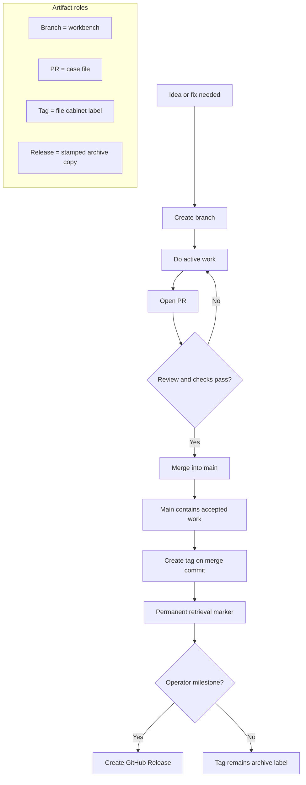
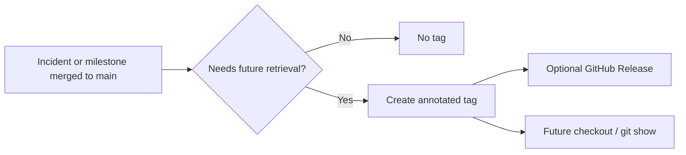

# Git branching and deployment hygiene

This project is safe to **run and test live on your machine** (local dev server, Docker, or any non-production URL you control). Iteration there does not, by itself, change what end users see.

Risk appears when you **push commits to the remote branch that your hosting or CI/CD treats as production** (or as the automatic deploy target). A push there can trigger builds, releases, or simply merge unfinished work into the line everyone else assumes is stable.

> **AxTask / Render specifics.** `render.yaml` is configured with
> `autoDeploy: true`, meaning every push (or merge) that lands on the
> production-deploy branch triggers a build and deploy immediately. Safety
> is delegated to the deploy-start chain in
> [`scripts/production-start.mjs`](../scripts/production-start.mjs):
> environment gate → capacity gate → SQL migrations → guarded Drizzle policy → server.
> Production startup must not run live Drizzle schema push by default; see
> [Schema Evolution Pipeline](./SCHEMA_EVOLUTION_PIPELINE.md).
> Because there is no human in the loop, the branching rules below are
> the *only* protection against shipping unfinished work — take them
> literally.

## Mental model



## Principles

1. **Experiment freely locally** — use `npm run start:local`, Docker, or your preferred flow; break things in your workspace without guilt.
2. **Isolate remote experiments** — create a **feature branch** (for example `feat/short-description` or `fix/issue-123`) for work that is not ready to ship.
3. **Integrate through a PR** — open a pull request into your team’s **integration branch** (whatever GitHub/GitLab shows as the default merge target, or the branch your pipeline deploys from—confirm with your team if unsure). Review and CI run there; only then should changes land on the deploy-tracking branch.
4. **Tag important merge commits** — incidents, deployment hardening, schema milestones, and releases should get annotated tags after they land in `main`.

Naming of the default or production branch can differ per fork (`main`, `master`, `release`, etc.). The rule is: **know which remote branch is wired to production deploy**, and do not use it as a scratchpad.

## Before every `git push`

- Run `git branch --show-current` (or your UI equivalent) and confirm you are on the branch you intend.
- Prefer pushing a **feature branch** first; merge to the deploy-connected branch only via PR after checks pass.
- Avoid **force-push** to shared branches others build from, especially any branch connected to production.
- Keep a release contract doc under `docs/releases/*.md` for each feature/release branch and run `npm run release:check` before opening the PR.

## PR insight checklist

Every PR that touches deploy, schema, auth, startup, env, Docker, Render, or migrations should include:

- clear diagnosis
- changed files grouped by purpose
- risk / rollback notes
- test evidence
- Mermaid diagram when the workflow or failure chain is easier to see visually
- tag recommendation if the PR is an incident fix or architecture checkpoint

## Tag naming

Use tags for durable lookup, not branches.

```text
incident/axtask-drizzle-startup-guard-2026-05-21
checkpoint/deployment-safety-env-automation-2026-05-21
release/axtask-v0.4.0
```



## Divergence playbook

Use this whenever your feature branch and `main` are no longer aligned and you want to avoid risky rework.

1. Confirm position:
   - `git branch --show-current`
   - `git fetch origin`
   - `git rev-list --left-right --count origin/main...HEAD` (behind/ahead counts)
2. Refresh evidence before code changes:
   - `git diff --name-only origin/main...HEAD`
   - `npm run release:check`
3. Reconcile safely from your feature branch:
   - `git merge origin/main`
   - Resolve conflicts and re-run focused tests for touched areas.
4. Re-validate deploy discipline:
   - Confirm migration/docs/env/route-inventory deltas are intentional.
   - Re-run `npm run release:check` and required test suites.
5. Ship through PR only:
   - Push branch, open/update PR, and keep Render pinned to the production branch until checks are green and review is complete.

### Branch divergence decision table

- **Small drift, no conflicts**: merge `origin/main` into feature branch now.
- **Drift + schema/migration overlap**: merge immediately and inspect SQL/data impact before deploy.
- **Large drift + mixed concerns**: split into smaller PRs first (feature vs deploy guardrails).
- **Hotfix needed now**: cut a dedicated hotfix branch from `main`, then back-merge into ongoing features.

## Related checks

- Large infrastructure moves: see [MORNING_NEW_BOX_MIGRATION_CHECKLIST.md](./MORNING_NEW_BOX_MIGRATION_CHECKLIST.md) (includes confirming the active branch before risky steps).
- If you add or rename Express routes, update the route inventory snapshot as described in [server/routes-inventory.contract.test.ts](../server/routes-inventory.contract.test.ts) (`vitest run` with `-u` on that file when the change is intentional).
- Schema evolution and production startup policy: [SCHEMA_EVOLUTION_PIPELINE.md](./SCHEMA_EVOLUTION_PIPELINE.md).
