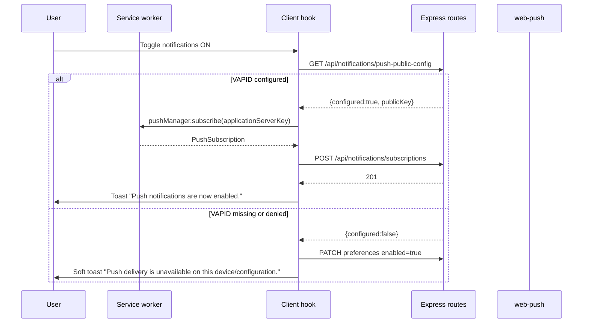

# Notifications and Web Push

Single source-of-truth for how AxTask notifications work end-to-end, how to
provision Web Push so it actually delivers to every device, and how to keep the
graceful in-app fallback intact. Enforces a small set of falsifiable invariants
via contract tests.

## Why this doc exists

Users have reported a scary toast `"Push key missing — Push delivery is not
configured yet..."` popping up when they enable notifications. That string does
**not** exist anywhere in the current client source (a contract test forbids
it). If you see it, you are looking at either a **stale service worker** from a
pre-refactor deploy, or at a **misconfigured deploy** where the server never
had VAPID keys, so push subscribe silently never completed. This document
covers both.

## Architecture overview



Server-side dispatch runs in the adherence cron tick. When VAPID is missing,
`dispatchAdherencePushNotifications()` short-circuits with `{attempted:0,
sent:0}` and never throws.

## Environment variables

| Name | Where | Required for push | Notes |
|------|-------|-------------------|-------|
| `VAPID_PUBLIC_KEY` | Server (runtime) | Yes | Authoritative public key. |
| `VAPID_PRIVATE_KEY` | Server (runtime) | Yes | Used by `web-push` to sign. |
| `VAPID_SUBJECT` | Server (runtime) | Optional, default `mailto:alerts@axtask.app` | `mailto:` or `https://` identifier. |
| `VITE_VAPID_PUBLIC_KEY` | Client (build time) | Recommended | Same value as `VAPID_PUBLIC_KEY`. Bakes the public key into the SPA bundle so the first-subscribe path does not depend on a runtime round-trip. `npm run vapid:generate` now emits this line uncommented so operators configure all four env vars in one copy-paste. |

If either `VAPID_PUBLIC_KEY` or `VAPID_PRIVATE_KEY` is missing the server logs a
single `[push] VAPID keys missing` warning at startup (see
[`server/index.ts`](../server/index.ts) `warnIfVapidMissing`).

## How to actually enable push (every device)

1. Install deps if you have not already, then generate a key pair locally:
   ```bash
   npm install
   npm run vapid:generate -- --subject mailto:you@example.com
   ```
   Use any email you actually monitor for the `--subject`; push providers only
   use it as a contact hint, no DNS / domain ownership is required. The script
   prints all four env-var lines uncommented to stdout and never persists the
   private key to disk. See [`scripts/generate-vapid-keys.mjs`](../scripts/generate-vapid-keys.mjs).
2. On Render (or your host), create all four environment variables using the
   output: `VAPID_PUBLIC_KEY`, `VAPID_PRIVATE_KEY`, `VAPID_SUBJECT`, and
   `VITE_VAPID_PUBLIC_KEY` (same value as `VAPID_PUBLIC_KEY`).
3. Redeploy. Confirm the startup log no longer shows `[push] VAPID keys
   missing`.
4. In each browser / installed PWA, hard-reload once so the service worker
   rotates to the latest `CACHE_VERSION` (see
   [`client/public/service-worker.js`](../client/public/service-worker.js)).
   The service worker calls `self.skipWaiting()` and `clients.claim()` so this
   happens automatically on the next navigation.
5. Toggle notifications on. You should see the toast
   `"Notifications on — Push notifications are now enabled."`.

## Invariants (enforced by tests)

1. The literal string `"Push key missing"` MUST NOT appear in any
   `client/src/**/*.ts{,x}` file. Enforced by
   [`client/src/hooks/use-notification-mode.contract.test.ts`](../client/src/hooks/use-notification-mode.contract.test.ts).
2. `toggleNotificationMode` MUST resolve VAPID before calling
   `Notification.requestPermission()` and MUST save the preference with
   `enabled: true` even when VAPID or permission are missing. Enforced by the
   same contract test.
3. `/api/notifications/preferences` response MUST include
   `pushConfigured`, `hasSubscription`, `deliveryChannel`, and `dispatchProfile`.
   `deliveryChannel` is `"push"` only when `enabled && pushConfigured &&
   hasSubscription`. Enforced by
   [`server/notification-preferences.contract.test.ts`](../server/notification-preferences.contract.test.ts).
4. `/api/notifications/push-public-config` MUST return
   `{ configured, publicKey? }`. Same contract test.
5. `dispatchAdherencePushNotifications()` MUST return `{attempted:0, sent:0}`
   without throwing when VAPID is missing or adherence is disabled. Enforced by
   [`server/adherence-dispatch.test.ts`](../server/adherence-dispatch.test.ts).
6. `server/index.ts` MUST log a warning that mentions both `VAPID_PUBLIC_KEY`
   and `VAPID_PRIVATE_KEY` when either is missing. Enforced by
   [`server/vapid-startup-observability.test.ts`](../server/vapid-startup-observability.test.ts).
7. [`client/public/service-worker.js`](../client/public/service-worker.js) MUST
   declare a versioned `CACHE_VERSION` and call `self.skipWaiting()` and
   `self.clients.claim()` so previously installed clients rotate. Enforced by
   [`client/public/service-worker.contract.test.ts`](../client/public/service-worker.contract.test.ts).
8. `package.json` MUST expose `scripts.vapid:generate` and the generator script
   MUST print all three env-var lines. Enforced by
   [`scripts/generate-vapid-keys.contract.test.ts`](../scripts/generate-vapid-keys.contract.test.ts).

## Troubleshooting

| Symptom | Most likely cause | Fix |
|---------|-------------------|-----|
| Toast "Push key missing" appears on enable. | Stale service worker or old cached bundle. | Bump `CACHE_VERSION` in `service-worker.js`, redeploy, hard-reload. |
| Toast "Notification mode is enabled. Push delivery is unavailable..." appears. | Server has no VAPID keys, or the browser denied permission, or the platform doesn't support Web Push. | Set `VAPID_PUBLIC_KEY` + `VAPID_PRIVATE_KEY`, redeploy. On iOS, Web Push requires iOS 16.4+ and the PWA must be installed to the home screen. |
| Preferences response says `pushConfigured:true` but user never receives a push. | `VAPID_PRIVATE_KEY` is set but doesn't match the public key, or the subscription is stale/expired. | Regenerate with `npm run vapid:generate`, update both envs, redeploy, have the user disable+re-enable notifications to refresh the subscription. |
| `deliveryChannel:"in_app"` even though push is configured. | User has no active `PushSubscription` row in the DB (fresh device, permission reset, SW unregistered). | Toggle notifications off and back on to trigger `pushManager.subscribe`. |
| Startup log shows `[push] VAPID keys missing`. | Env vars not set in this environment. | Add them in Render / docker-compose / `.env` and restart the server. |

## Related files

- Client hook: [`client/src/hooks/use-notification-mode.tsx`](../client/src/hooks/use-notification-mode.tsx)
- Server routes: [`server/routes.ts`](../server/routes.ts) (`/api/notifications/*`)
- Dispatcher: [`server/services/adherence-dispatch.ts`](../server/services/adherence-dispatch.ts)
- Service worker: [`client/public/service-worker.js`](../client/public/service-worker.js)
- Startup warning: [`server/index.ts`](../server/index.ts) `warnIfVapidMissing`
- Generator: [`scripts/generate-vapid-keys.mjs`](../scripts/generate-vapid-keys.mjs)
- Related: [`docs/ADHERENCE_FEATURES.md`](ADHERENCE_FEATURES.md)
