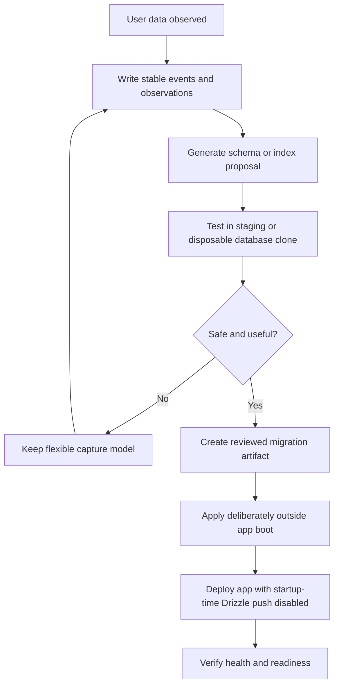
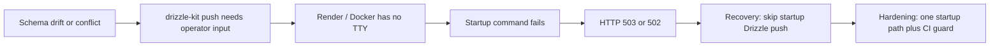

# Schema Evolution Pipeline

AxTask can learn from user activity and improve its data model over time. The boundary is simple: production startup should boot the app, not negotiate live schema changes.

## Canonical model



## Production startup model

```mermaid
flowchart TD
    A[Render / Docker / npm start] --> B[scripts/production-start.mjs]
    B --> C[Environment gate]
    C --> D[DB capacity gate]
    D --> E[Versioned SQL migrations]
    E --> F{Drizzle push explicitly allowed?}
    F -- No: default production posture --> G[Skip drizzle-kit push]
    F -- Yes: operator override --> H[Run drizzle-kit push deliberately]
    G --> I[Start server]
    H --> I
    I --> J[/health]
    I --> K[/ready]
```

## Policy

Production startup may validate environment variables, check database readiness/capacity, apply deterministic SQL migrations, and start the server.

Production startup must not run live Drizzle schema push by default, ask interactive prompts, auto-accept risky schema changes, or maintain separate Render, Docker, and npm startup logic.

## Safe learning pattern

Use stable capture structures first: event tables, observation tables, candidate field tables, JSONB metadata, feature extraction tables, and derived analytical tables.

When observations suggest a schema change, generate a proposal, test it in staging or a database branch, create a reviewed migration, apply it deliberately, then deploy with startup-time Drizzle push disabled.

## Guardrails in this repo

Relevant files:

- `scripts/production-start.mjs`
- `Dockerfile`
- `render.yaml`
- `tools/ci/check-production-startup-guard.mjs`
- `.github/workflows/production-startup-guard.yml`
- `tests/deploy/00-contract/package-scripts.test.ts`



## Design principle

Schema evolution is allowed. Unattended production schema mutation during app boot is not.
