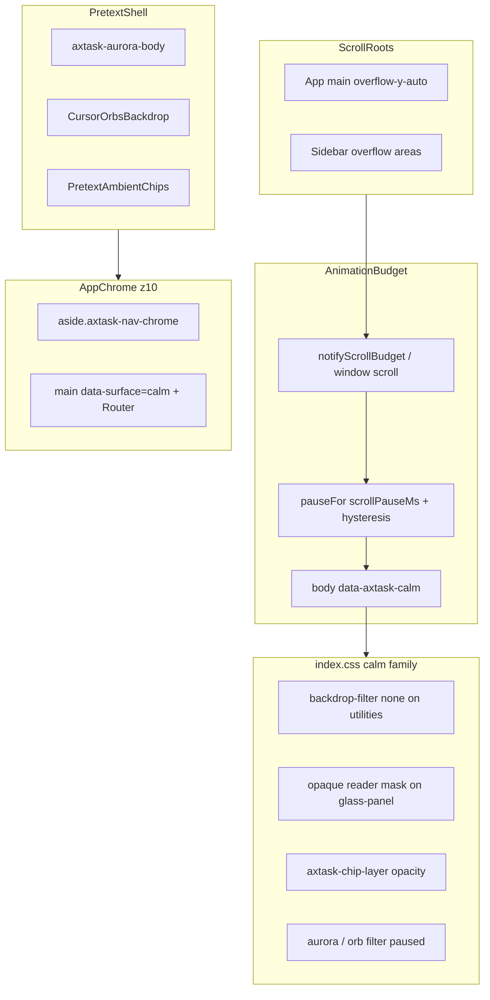

# Scroll, refresh, and calm-mode visual stability

**Status:** Resolved (2026-04-25 integration). This document is the **canonical handoff** for the incident class: panels blanking or flickering on scroll, Pretext ambient chips reading through glass, subtle **hue flashes** when calm-mode toggles, Task Timeline / Gantt axis text stretching, and confusion between **browser refresh / cache** vs **compositor calm-mode**.

Read this before changing Pretext shells, glass utilities, `animation-budget`, app scroll roots, sidebar chrome, or the planner **TaskGantt** SVG.

---

## Vocabulary

- **`data-axtask-calm`** — Attribute on `<body>` set by [`client/src/lib/animation-budget.ts`](../client/src/lib/animation-budget.ts) while scroll/longtask pauses are active. CSS in [`client/src/index.css`](../client/src/index.css) uses it to drop expensive compositor work (`backdrop-filter`, heavy `filter`, `transition-all` on broad selectors, etc.).
- **Reader mask** — During calm, `.glass-panel*` and `.axtask-calm-blur-fallback` get an **opaque** `background-color` because blur is stripped. In dark theme, resting glass was almost **blur-only** (`bg-white/[0.05]`); without blur, Pretext chips behind the panel became **legible foreground**, not atmosphere.
- **Calm release hysteresis** — After the scroll-pause timer fires, calm stays on for **`CALM_RELEASE_HYSTERESIS_MS` (90 ms)** longer so `data-axtask-calm` does not flip on every wheel edge (reduces perceived flash). Implemented in `animation-budget.ts` chained timeouts after `DEFAULT_SCROLL_PAUSE_MS` (250).
- **Chrome vs content** — **Navigation** surfaces that sit over the fixed Pretext stack use **`.axtask-nav-chrome`** (opaque `var(--card)`), not `.glass-panel-glossy`, so they do **not** participate in the calm glass colour swap. **Reading surfaces** (planner cards, rewards panels, etc.) may still use glass + reader mask + explicit transitions.

---

## Resolution summary (2026-04-25)

### What was broken (symptoms users reported)

1. **Panels “going blank” or losing inner content** while scrolling — compositor pressure (`content-visibility`, transforms, backdrop blur, ambient rAF) fighting scroll.
2. **Ambient chips** (“Focus”, “Flow”, …) **showing through** cards and sidebar — especially when calm-mode stripped `backdrop-filter` and dark glass was nearly transparent.
3. **Subtle hue / contrast pulse** on every scroll burst — `body[data-axtask-calm]` toggling ~250 ms while CSS swapped resting frosted glass vs forced opaque reader fills; **binary** perceived colour change.
4. **Task Timeline / Gantt** — date labels **distorted**, huge, overlapping — SVG **`preserveAspectRatio="none"`** stretched **text** non-uniformly in X vs Y.

### What fixed it (engineering themes)

| Theme | What we did |
| ----- | ----------- |
| **Scroll drives calm** | Main shell and sidebar call **`notifyScrollBudget()`** so inner `overflow-y-auto` scroll counts, not only `window` scroll ([`client/src/App.tsx`](../client/src/App.tsx), [`client/src/components/layout/sidebar.tsx`](../client/src/components/layout/sidebar.tsx)). |
| **Opaque nav chrome** | Desktop `<aside>` and mobile **`SheetContent`** use **`.axtask-nav-chrome`** instead of **`glass-panel-glossy`** so nav is not on the calm glass swap path over chips. |
| **Reader mask + smooth glass** | Calm still strips blur for perf; **opaque fills** and **explicit** `transition-property: background-color, backdrop-filter, …` on glass (not `transition-all`) so swaps read as “thickening” not a flash ([`client/src/index.css`](../client/src/index.css)). |
| **Chip layer** | Calm dims `.axtask-chip-layer` **without** `transition: opacity` (opacity animation caused extra flash). |
| **Hysteresis** | **`CALM_RELEASE_HYSTERESIS_MS = 90`** after scroll pause expiry extends `data-axtask-calm` briefly ([`client/src/lib/animation-budget.ts`](../client/src/lib/animation-budget.ts)). |
| **Stable panels** | Critical planner blocks use **`.axtask-stable-panel`** (translateZ, `contain: paint`, calm-scoped animation suppression) — see `index.css`. |
| **Gantt** | Wrapper **`aspectRatio: 100 / svgHeight`** + SVG **`preserveAspectRatio="xMidYMid meet"`** so axis text scales **uniformly** ([`client/src/components/task-gantt.tsx`](../client/src/components/task-gantt.tsx)). |

**Reference integration commit (example):** `fa546f8` on branch `aaa/2026-04-25-gentle-reminder-chat-integration` (holistic nav chrome, Gantt meet, hysteresis, doc seed). Earlier reader-mask work includes `2b1120c` and follow-up tuning; always **`git log`** / **`git show`** on your branch for exact literals.

---

## Architecture



**Layering reminder:** Pretext aurora + orbs + chips sit **behind** authenticated children (`z-0` vs content `z-10` in [`client/src/components/pretext/pretext-shell.tsx`](../client/src/components/pretext/pretext-shell.tsx)). If a surface is translucent without blur during calm, **chips remain visible** in DevTools pixel terms—that is expected unless the surface is opaque or masked.

---

## Symptom matrix

Use this before deep-diving the wrong subsystem.

- **Symptom:** Entire card or region goes **empty white/grey** mid-scroll, then returns.  
  **Likely cause:** `content-visibility`, transform scale, or aggressive transitions on a large subtree.  
  **Start:** [`client/src/App.tsx`](../client/src/App.tsx) (`safeRenderMode` / scale), [`client/src/index.css`](../client/src/index.css) (`.axtask-stable-panel`, calm rules), the specific page card classes.

- **Symptom:** **Green pill chips** readable **through** sidebar or glass cards after scroll.  
  **Likely cause:** Calm stripped blur; panel relied on blur for masking; or nav still used glass over Pretext.  
  **Start:** `index.css` reader mask + `.axtask-nav-chrome` on [`sidebar.tsx`](../client/src/components/layout/sidebar.tsx); chip markup [`pretext-confirmation-shell.tsx`](../client/src/components/pretext/pretext-confirmation-shell.tsx).

- **Symptom:** **Subtle colour / brightness pulse** every time scrolling “settles”.  
  **Likely cause:** `data-axtask-calm` toggling while glass background jumps between translucent and opaque; chip opacity edge.  
  **Start:** [`animation-budget.ts`](../client/src/lib/animation-budget.ts) (timers, hysteresis), `index.css` glass transitions and chip layer rules.

- **Symptom:** Gantt **dates look stretched or crushed**.  
  **Likely cause:** SVG `preserveAspectRatio="none"` with `<text>` in the same scaled coordinate system.  
  **Start:** [`task-gantt.tsx`](../client/src/components/task-gantt.tsx).

- **Symptom:** “Refresh didn’t fix it” — **stale UI or old bundle**.  
  **Likely cause:** Service worker cache, persisted React Query, or CDN — **not** calm-mode.  
  **Start:** [`client/public/service-worker.js`](../client/public/service-worker.js), [`client/src/lib/query-persist-policy.ts`](../client/src/lib/query-persist-policy.ts), [`client/src/components/offline-data-banner.tsx`](../client/src/components/offline-data-banner.tsx) (hard refresh path).

---

## File and responsibility map

| Area | File | Responsibility |
| ---- | ---- | ---------------- |
| Scroll → budget | [`client/src/App.tsx`](../client/src/App.tsx) | Main authenticated scroll `div` calls **`onMainShellScroll`** → **`notifyScrollBudget()`** (rAF-throttled). |
| Sidebar scroll | [`client/src/components/layout/sidebar.tsx`](../client/src/components/layout/sidebar.tsx) | **`onSidebarScroll`** → **`notifyScrollBudget()`**; desktop **`aside`** + mobile **`SheetContent`** use **`.axtask-nav-chrome`**. |
| Calm state machine | [`client/src/lib/animation-budget.ts`](../client/src/lib/animation-budget.ts) | **`DEFAULT_SCROLL_PAUSE_MS` (250)**, **`CALM_RELEASE_HYSTERESIS_MS` (90)**, **`pauseFor`**, mirrors **`data-axtask-calm`** on `<body>`. |
| Calm CSS family | [`client/src/index.css`](../client/src/index.css) | **`body[data-axtask-calm]`** rules: backdrop off, aurora/orb, **reader mask** on `.glass-panel*`, **`.axtask-calm-blur-fallback`**, **`.axtask-chip-layer`**, **`.axtask-nav-chrome`**, **`.axtask-stable-panel`**, glass **transition-property** list (not `all`). |
| Pretext stack | [`client/src/components/pretext/pretext-shell.tsx`](../client/src/components/pretext/pretext-shell.tsx) | Single-mount aurora + orbs + optional chips; default chip labels. |
| Ambient chips | [`client/src/components/pretext/pretext-confirmation-shell.tsx`](../client/src/components/pretext/pretext-confirmation-shell.tsx) | **`PretextAmbientChips`**, **`data-pretext-chip`**, rAF drift (respects **`isAnimationAllowed()`**). |
| Gantt | [`client/src/components/task-gantt.tsx`](../client/src/components/task-gantt.tsx) | Timeline SVG: **`meet`** + wrapper **`aspectRatio`**. |
| Contracts | [`client/src/index.calm-mode.contract.test.ts`](../client/src/index.calm-mode.contract.test.ts), [`client/src/lib/animation-budget.test.ts`](../client/src/lib/animation-budget.test.ts), [`client/src/components/task-gantt.test.ts`](../client/src/components/task-gantt.test.ts) | String / behaviour guards so calm CSS and Gantt policy do not regress silently. |

Related **refresh / cache** (not calm compositor):

| Area | File | Notes |
| ---- | ---- | ----- |
| SW cache | [`client/public/service-worker.js`](../client/public/service-worker.js) | Versioned cache; API bypass rules. |
| Query persist clear | [`client/src/lib/query-persist-policy.ts`](../client/src/lib/query-persist-policy.ts) | Hard-refresh helpers for persisted client state. |
| Operator banner | [`client/src/components/offline-data-banner.tsx`](../client/src/components/offline-data-banner.tsx) | “Hard refresh” / stale copy UX. |

---

## “Refresh” vs “scroll calm” (do not conflate)

| Concern | Mechanism | User-visible signal |
| ------- | --------- | --------------------- |
| **Scroll / compositor calm** | `animation-budget` + `body[data-axtask-calm]` + `index.css` | Hue pulse, blur disappearing, chips sharper, **while interacting** (scroll, longtask). |
| **Browser refresh / cache** | HTTP reload, service worker, persisted queries | Old bundle, stale data, wrong copy after deploy — **often fixed by hard refresh or SW update**, not by changing calm CSS. |

If the report is “only after I hit reload,” verify **network** (304 / SW), **Application → Service Workers**, and persisted query keys before rewriting Pretext.

---

## Failure mode: “hue flash” on every scroll burst (deep dive)

**Symptom:** Panels or chrome **change colour subtly** when scrolling stops and starts, or ambient chips **pulse** against the UI.

**Root cause:** `data-axtask-calm` toggles while CSS switches between (a) resting frosted glass (translucency + blur) and (b) calm rules (no blur + opaque fill). If resting and calm fills differ visibly, the swap reads as a flash. Commit **`2b1120c`** introduced **`body[data-axtask-calm] .glass-panel { background-color: … !important }`** to stop chips bleeding through; combined with **rapid** calm toggling (~250 ms windows), that could read as a **colour snap** until mitigated by **nav chrome split**, **glass transitions**, **chip layer without opacity transition**, and **hysteresis**.

**Mitigations in tree** (see resolution table above): opaque **`.axtask-nav-chrome`**, reader mask + explicit glass transitions, chip dim **without** opacity animation, **`CALM_RELEASE_HYSTERESIS_MS`**.

---

## Failure mode: Task Timeline / Gantt distorted text

**Symptom:** Axis date labels look **stretched, huge, or overlapping**.

**Root cause:** SVG **`preserveAspectRatio="none"`** scales X and Y independently; **`<text>`** inherits non-uniform scale.

**Mitigation:** [`task-gantt.tsx`](../client/src/components/task-gantt.tsx) — outer wrapper sets `aspectRatio` to `100 / ${svgHeight}` (see source); `<svg>` uses **`preserveAspectRatio="xMidYMid meet"`**, **`width="100%"`**, **`height="100%"`**, **`className="block h-full w-full"`**.

---

## When you change UI (contract)

- **New reader surfaces:** Use **`.glass-panel`** / **`.glass-panel-elevated`** / **`.axtask-calm-blur-fallback`** as documented; avoid bare **`backdrop-blur-*`** on large translucent fills over the aurora without a calm fallback class.
- **New chrome (nav, rails, drawers) fixed over Pretext:** Prefer **`.axtask-nav-chrome`** or another **opaque** shell — do not default to **`glass-panel-glossy`** for full-height chrome.
- **New scroll containers** (any `overflow-y: auto` that users scroll for seconds at a time): Call **`notifyScrollBudget()`** on scroll (rAF-throttle if high frequency) so calm tracks real behaviour (see [`App.tsx`](../client/src/App.tsx), [`sidebar.tsx`](../client/src/components/layout/sidebar.tsx)).
- **Heavy motion on scroll paths:** Avoid **`transition-all`** on large subtrees; calm already sets **`transition-property: none`** on **`.transition-all`** while active — prefer specific properties for hovers.

---

## Debugging playbook

1. **Confirm calm is involved:** In DevTools Elements, watch **`<body>`** for **`data-axtask-calm`**. Scroll the **main** column and the **sidebar**; attribute should appear during scroll bursts (with hysteresis tail).
2. **Separate refresh issues:** If repro **only** after full reload, check **Service Worker** + **disable cache** in Network — do not chase calm CSS first.
3. **Nav stack:** Inspect desktop **`aside`** — expect class **`axtask-nav-chrome`**, not **`glass-panel-glossy`** on the shell.
4. **Glass reader:** Pick a rewards/planner card — during calm, expect **opaque** background from reader mask rules in **`index.css`**, not “invisible over aurora.”
5. **Gantt:** Search **`task-gantt.tsx`** for **`preserveAspectRatio="xMidYMid meet"`** and wrapper **`aspectRatio`**. Grep the repo for **`preserveAspectRatio="none"`** on SVGs that still render **axis labels** inside the same `<svg>` (forbidden pattern for time axes).
6. **Regressions in CSS:** Run **`npx vitest run client/src/index.calm-mode.contract.test.ts`** — fast string contracts on the calm block.

---

## Do / Don’t (quick list)

**Do**

- Wire **every** important scroll root to **`notifyScrollBudget()`**.
- Use **`.axtask-nav-chrome`** for nav / sheet shells over Pretext.
- Use **`.axtask-stable-panel`** for critical long-scroll cards when appropriate.
- Keep **`transition-property`** explicit on glass (see `index.css`).

**Don’t**

- Don’t rely on **`backdrop-filter` alone** for dark “glass” readability — calm will remove it.
- Don’t put **`transition-all`** on huge scroll regions.
- Don’t use **`preserveAspectRatio="none"`** on SVGs that contain **readable text** for a time axis.
- Don’t assume **`window` scroll** equals app scroll — the shell scrolls an **inner** `div`.

---

## Verification commands

```bash
npm run check
npx vitest run client/src/index.calm-mode.contract.test.ts client/src/lib/animation-budget.test.ts client/src/components/task-gantt.test.ts
```

Optional broader gate before merge (when touching adjacent client code):

```bash
npm test
```

**Manual smoke (dark theme recommended):** `/planner` — scroll for 10–15 s; confirm no rapid hue pulse on nav; Task Timeline axis labels readable. `/rewards` — same. Toggle sidebar width if applicable.

---

## Related documentation

- Performance budget context: [docs/PERF_PERFORMANCE_BUDGETS.md](./PERF_PERFORMANCE_BUDGETS.md) (Client — animation budget).
- Pretext / product split: [docs/FREEMIUM_PREMIUM_AND_PRETEXT.md](./FREEMIUM_PREMIUM_AND_PRETEXT.md).
- Orb / chip product language: [docs/ORB_AVATAR_EXPERIENCE_CONTRACT.md](./ORB_AVATAR_EXPERIENCE_CONTRACT.md).
- Short debugging entry point: [docs/DEBUGGING_REFERENCE.md](./DEBUGGING_REFERENCE.md).
