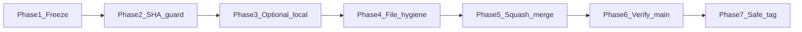

# PR #41 merge playbook

## Ground truth

PR #41 is currently open, mergeable, not draft, and green on latest head:

```text
head: 5086659ce9cbcd3bcb81ea47269d440c61783af0
```

Latest checks are green:

- Security - Axios Guard
- pr-file-limit
- test-and-attest

**Merge rule — no env junk drawer:** Do not add `AUTH_AUDIT_PEPPER`, `TOTP_*`, or any additional CI env variable unless a current failing check proves it is required. Green CI means no more env expansion.

## Phase 1 — Freeze

Allowed:

- review-thread replies
- requested documentation clarification
- critical bug fixes only

Avoid:

- cleanup
- polish
- Foundry tweaks
- new feature work
- new CI env vars without failing proof

## Phase 2 — Pre-merge SHA guard

Before squash merge, confirm the PR head SHA is still:

```text
5086659ce9cbcd3bcb81ea47269d440c61783af0
```

If the head SHA changed, stop and re-check CI before merging.

```bash
gh pr view 41 --json headRefOid,mergeable,state,isDraft
```

Expected:

```text
state: OPEN
isDraft: false
mergeable: MERGEABLE
headRefOid: 5086659ce9cbcd3bcb81ea47269d440c61783af0
```

## Phase 3 — Optional local sanity, only if local env is healthy

```bash
git checkout feature/2026-05-01-session-security
git pull
npm run check
npm test
npm run build
```

Skip this phase if local environment is stale, missing DB config, or likely to produce noise unrelated to PR readiness. CI already passed the authoritative convergence checks.

## Phase 4 — File hygiene

```bash
gh pr diff 41 --name-only
```

Fast suspicious-file scan:

```bash
gh pr diff 41 --name-only | grep -Ei '(^|/)(\.env|.*secret.*|.*key.*|test-results|screenshots|coverage|\.zip|\.log|\.tmp|\.cache|dist|node_modules)'
```

Expected: either no output, or every hit has an obvious reason.

Inspect env/render files directly:

```bash
gh pr diff 41 -- .env.render.example .env.example .env.production.example render.yaml
```

Reason: env examples and Render config are exactly where secrets accidentally dress up as documentation.

Stop if any real secret, local path, debug artifact, generated dump, or accidental binary appears.

## Phase 5 — Squash merge

Strategy: squash merge.

Suggested title:

```text
feat: consolidate AxTask command, reminder, and session foundations
```

Suggested body:

```text
Consolidates session TTL hardening, registration/env audit support, safe boot config summaries, browser-bound signal documentation, shared intent parsing, command dispatcher updates, AI create-task/create-reminder execution, AI feedback capture, location/reminder APIs, task reminder persistence, reminder dispatch services, migration updates, and branch retirement documentation.
```

## Phase 6 — Verify main

Avoid testing stale local `main`:

```bash
git fetch origin
git checkout main
git pull --ff-only
git log --oneline -n 5
```

Then:

```bash
npm run check
npm test -- server/session-config.test.ts
npm test -- server/registration-config.test.ts
npm test -- server/boot-config-summary.test.ts
npm test -- shared/intent/parse-natural-command.test.ts
npm test -- server/services/reminder-dispatch.test.ts
npm run build
```

## Phase 7 — Safe checkpoint tag

```bash
git fetch --tags
git tag -l checkpoint-2026-05-01-convergence
```

If no output:

```bash
git tag checkpoint-2026-05-01-convergence
git push origin checkpoint-2026-05-01-convergence
```

If it already exists:

```bash
git tag checkpoint-2026-05-01-convergence-2
git push origin checkpoint-2026-05-01-convergence-2
```

No wrestling with existing tags. Tags are bookmarks, not a blood feud.

## Stop conditions

Stop if:

- PR head SHA changed (relative to the guard above) without re-validating CI
- checks are no longer green
- PR is no longer mergeable
- file hygiene finds real secrets or artifacts
- merge method is not squash
- main verification fails after merge


