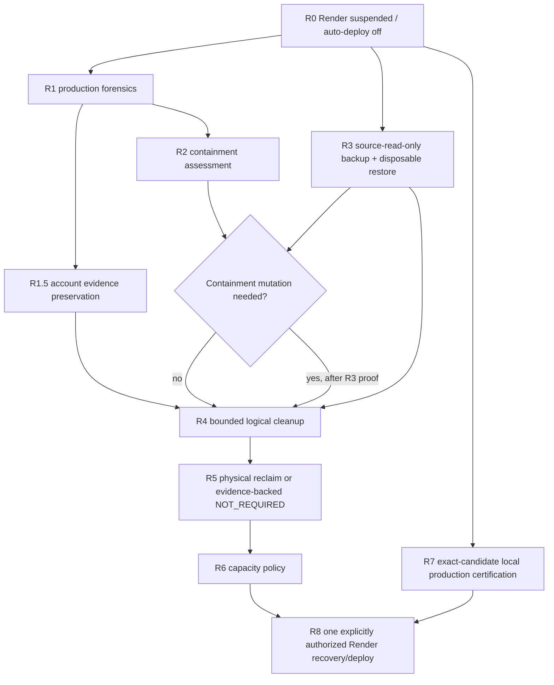

# Recovery-aware predeploy readiness — 2026-09-06

## Diagnosis

Current recovery evidence identifies the production 503 startup blocker as the database-capacity gate: approximately 36.20 GB total database size, approximately 36.19 GB in `public.security_events`, against a configured 10.00 GB operator capacity budget. The exact production event mix and remaining preservation/cleanup proof still belong to the protected recovery sequence.

At sprint start, `main` was `de5dd317ba67320600e5b8428a65565b9077daf0`; its parent is PR #146 merge `b4d3bdac13e73cb6458b630e0d4dec69fbd4990c`. GitHub Actions run `34044694367` on that merge passed typecheck, full tests, release contract, production build, account-backup round trip, migration/bootstrap verification, and local production certification. Open PR #139 is outside this sprint and remains untouched.

The deployment-control defect was separate from the original 503: `evaluate-predeploy-readiness.mjs` could emit `READY_FOR_AUTHORIZED_DEPLOYMENT` from repository/backup/build/local-runtime evidence while the active R0–R7 production recovery gates were still incomplete.

## Implemented control

The evaluator now fails closed around the active recovery sequence:

- active recovery evidence is bound to the exact `candidateSha`;
- every R0–R7 gate is an evidence record with `status` plus a machine-recognizable durable proof token;
- R5 may use `NOT_REQUIRED` only with durable evidence proving physical reclaim unnecessary;
- all other active gates require `PASS` plus durable evidence;
- omitted recovery evidence, plain string statuses, stale candidate binding, missing evidence, or malformed evidence remain `NOT_READY_RECOVERY`;
- post-incident `active=false` requires durable closure evidence using `operator-proof:`, `artifact:`, `workflow:`, `run:`, `commit:`, or `merge:`.

The result contract adds `NOT_READY_RECOVERY` / `COMPLETE_PRODUCTION_RECOVERY_GATES`.

## Recovery flow



R1 and R3 are intentionally parallel. R1.5 and R2 assessment can proceed after R1; any R2 mutation still depends on R3. R8 remains operator-authorized and outside this PR.

## Queue reconciliation

`.ai/WORK_QUEUE.md` records AXQ-007/R7 as `DONE` from workflow `34044694367`; current repository/runtime changes in this PR are harness/docs-only. The recovery-wave validator is updated to accept either an executable `READY` R7 or a durably proven `DONE` R7, so future candidate movement can reopen R7 without breaking the contract.

AXQ-001/R1 and AXQ-003/R3 remain operator-owned. R8 remains blocked behind production recovery/capacity convergence.

## Review / reconciliation

- Bare `active=false` was identified as an escape hatch -> durable closure evidence became mandatory.
- Arbitrary free text was still too weak -> evidence is restricted to repository durable-proof prefixes.
- R5 `NOT_REQUIRED` lacked proof -> all active recovery statuses now carry durable evidence, including R5.
- Recovery statuses were not candidate-bound -> active packets now require `productionRecovery.candidateSha === candidateSha`.
- AXQ-007 `DONE` conflicted with a validator hard-coded to `READY` -> validator now supports `READY` or evidence-bearing `DONE` instead of reverting current truth.
- The evaluator was reformatted after safety changes to preserve explicit ownership and readable control flow.

## Rollout

This PR changes repository-side deployment evaluation only. Once merged, future predeploy evidence packets must use the new candidate-bound recovery record shape. Existing callers are limited to the evaluator CLI/contracts in this repository; malformed or legacy active-recovery input fails closed as `NOT_READY_RECOVERY` rather than authorizing deployment.

No provider setting, Render service, Neon database, production row, migration, or R8 state is changed by rollout.

## Rollback

Provider rollback is **not applicable** because this PR performs no provider mutation and no production deployment. If the repository change itself must be reverted, revert the merge commit on `main`; doing so restores only the evaluator/schema/workflow/queue behavior and does not alter production data or provider state.

## Testing

Required exact-head proof:

```bash
npx vitest run server/ai-harness/predeploy-readiness-contract.test.ts
node scripts/ai-harness/validate-recovery-wave.mjs
node scripts/ai-harness/validate-authority.mjs
node scripts/ai-harness/validate-harness.mjs
node scripts/ai-harness/validate-harness-infrastructure.mjs
npm run release:check
npm run check
npm test
npm run build
git diff --check origin/main...HEAD
```

The `.ai/**` diff also triggers the agent-workspace harness, whose exact-head whitespace gate executes `git diff --check` after fetching the PR base without force.

## Proof ceiling / remaining boundary

This release closes the repository/local-runtime deployment-readiness false green. It does **not** prove production R1/R1.5/R2/R3/R4/R5/R6, authorize R8, or mutate Render/Neon. The next live recovery evidence remains operator-controlled R1 and R3, followed by the dependency-ordered preservation/containment/cleanup/capacity gates and finally one explicitly authorized R8 attempt.
